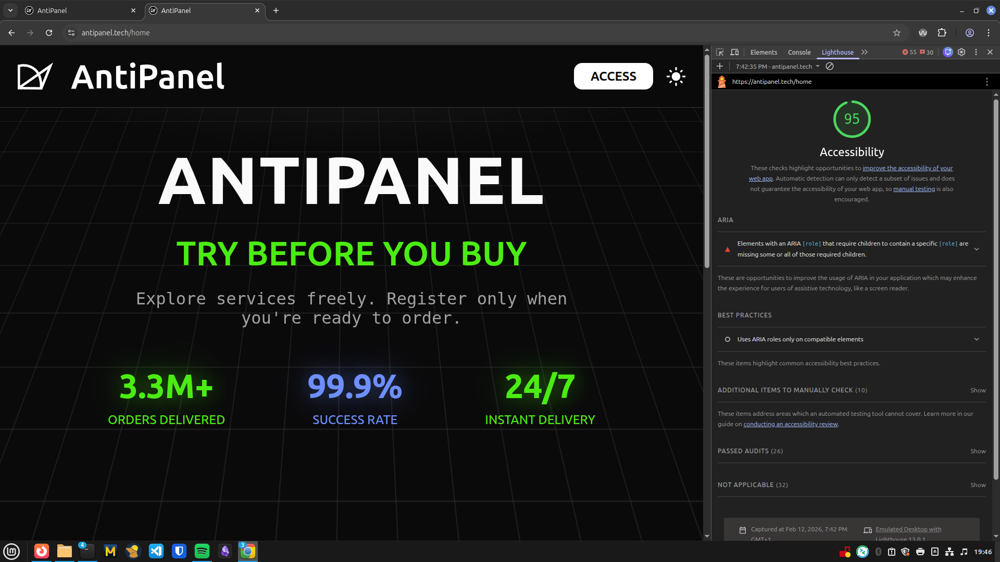
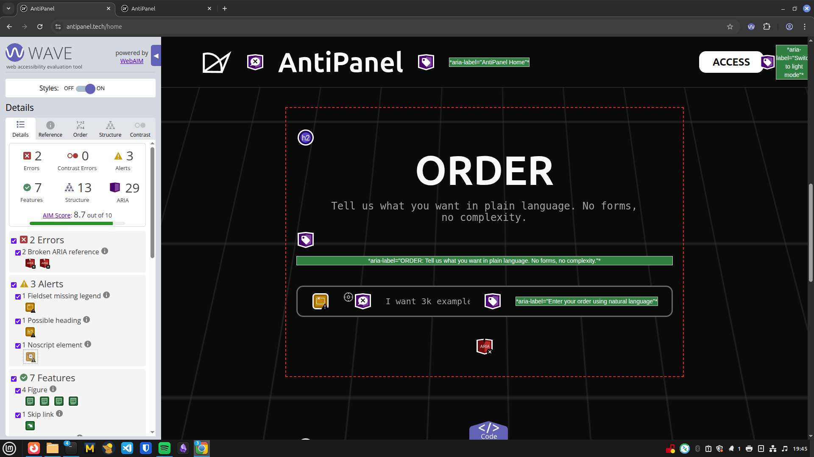
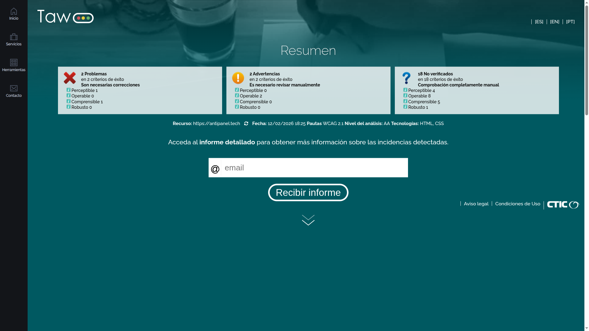
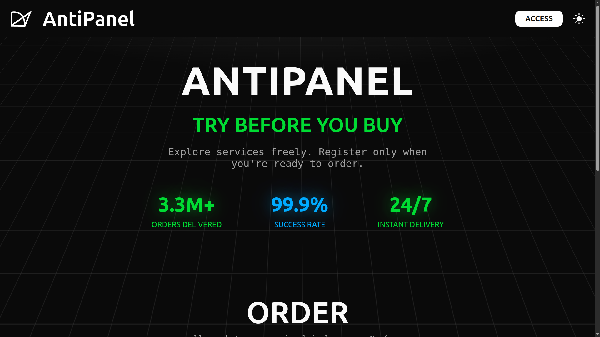
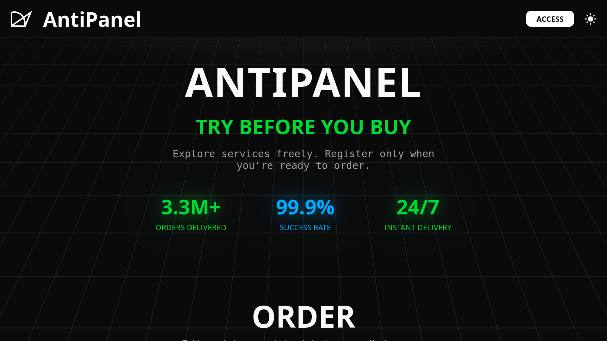
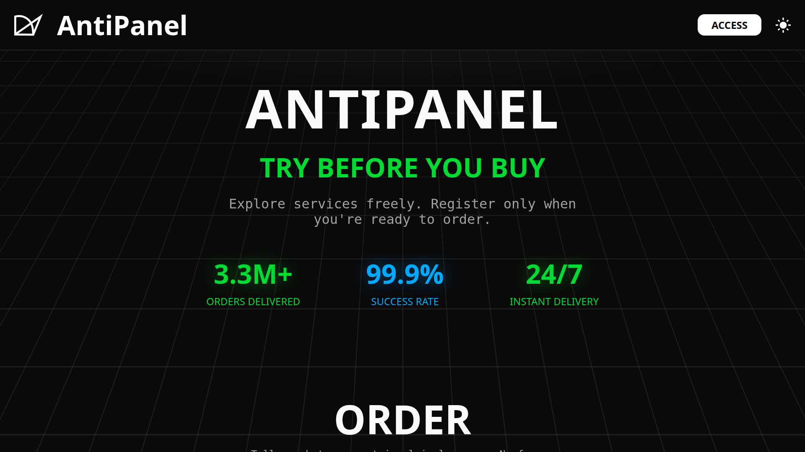
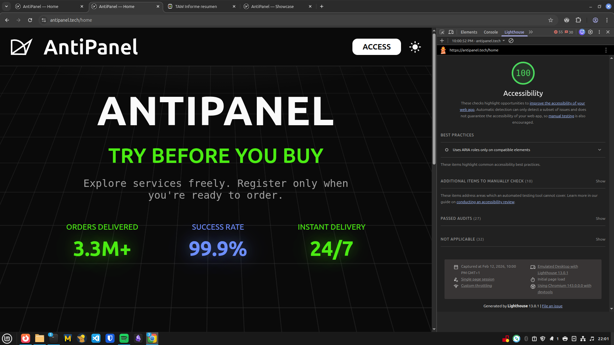
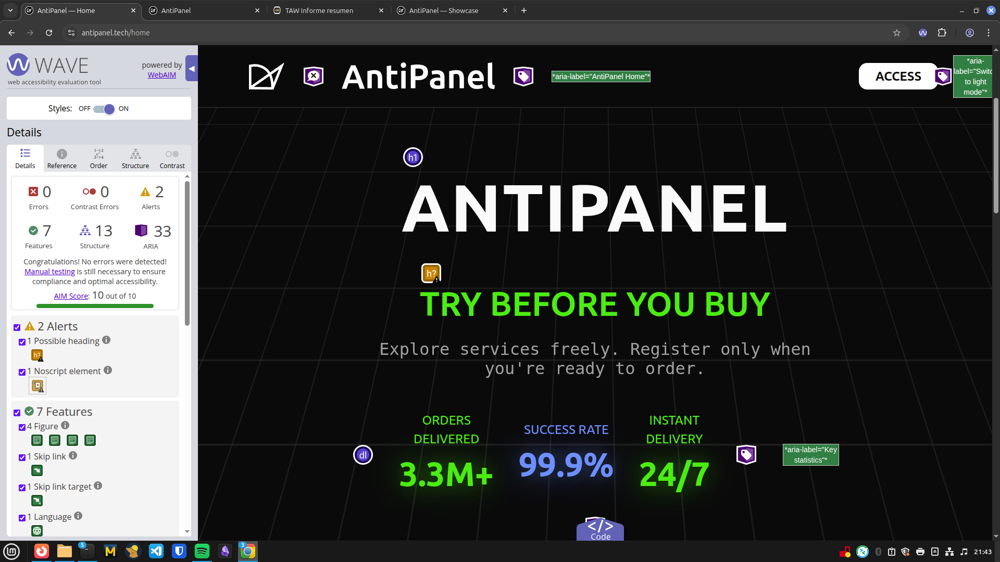
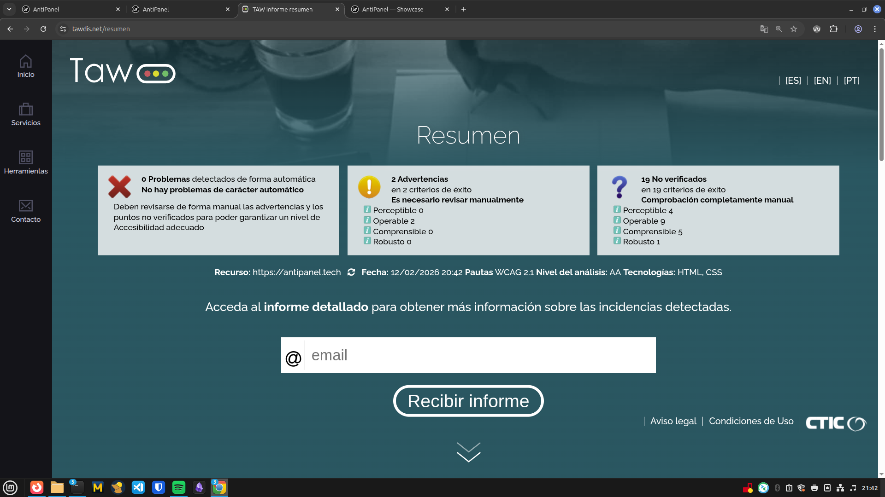

# Proyecto 4 => Accesibilidad y Multimedia

## 1. Fundamentos de Accesibilidad

### Por que es importante la accesibilidad web

Cuando empece este proyecto no le daba mucha importancia a la accesibilidad, solamene escuchaba en mis oidos constantemente "usabilidad y accesibilidad" pero no sabia exactamente la importancia de este último  => pensaba que era algo que se añade al final si da tiempo. Pero trabajando en esta practica me di cuenta de algo que deberia haber sido obvio: cuando construyes una web, estas decidiendo quien puede usarla y quien no. Cada boton sin foco de teclado, cada imagen sin alt, cada formulario sin etiqueta es una puerta que le cierras a alguien... personas con discapacidad visual, auditiva, motora o cognitiva, pero tambien a cualquiera con una limitacion temporal o situacional. Al final la accesibilidad no es un extra tecnico, es una cuestion de respeto hacia las personas que van a usar lo que tu construyes. Y esto ya no es solo ética, desde junio de 2025 la Ley Europea de Accesibilidad (Directiva 2019/882, transpuesta en España como Ley 11/2023) obliga tambien al sector privado: e-commerce, banca, tecnología. Ya no es "solo webs publicas" como con el antiguo Real Decreto 1112/2018, ahora nos afecta a todos los que desarrollamos productos digitales.

### Principios WCAG 2.1

Las Pautas de Accesibilidad para el Contenido Web (WCAG 2.1) se estructuran en cuatro principios fundamentales:

**1. Perceptible** => La informacion y los componentes de la interfaz deben presentarse de formas que los usuarios puedan percibir.
- *Ejemplo en AntiPanel:* Todas las imagenes de la galeria de accesibilidad incluyen texto alternativo descriptivo (`alt`) para que los lectores de pantalla puedan comunicar su contenido. Los iconos SVG decorativos usan `aria-hidden="true"` para no interrumpir la lectura.

**2. Operable** => Los componentes de la interfaz y la navegacion deben ser operables por todos los usuarios.
- *Ejemplo en AntiPanel:* El componente de tabs implementa navegacion completa por teclado (ArrowLeft/ArrowRight, Home, End) siguiendo el patron WAI-ARIA. El modal atrapa el foco con Tab/Shift+Tab y se cierra con Escape.

**3. Comprensible** => La informacion y el manejo de la interfaz deben ser comprensibles.
- *Ejemplo en AntiPanel:* Los formularios muestran mensajes de error con `role="alert"` vinculados al campo via `aria-describedby`, indicando exactamente que hay que corregir. Los campos requeridos usan `<span class="sr-only">(required)</span>` para lectores de pantalla.

**4. Robusto** => El contenido debe ser lo suficientemente robusto para ser interpretado por una amplia variedad de agentes de usuario.
- *Ejemplo en AntiPanel:* Todos los componentes interactivos (tabs, accordion, modal) implementan roles ARIA correctos (`role="tablist"`, `role="region"`, `aria-modal="true"`) y estados dinamicos (`aria-expanded`, `aria-selected`) para compatibilidad con tecnologias de asistencia.

### Niveles de Conformidad

- **Nivel A** => Requisitos basicos. Sin ellos, algunos usuarios no pueden acceder al contenido (ej: texto alternativo en imagenes, navegacion por teclado).
- **Nivel AA** => Eliminacion de barreras significativas. Es el nivel exigido legalmente en la UE y el objetivo de este proyecto (ej: contraste minimo 4.5:1, indicador de foco visible, titulos de pagina descriptivos).
- **Nivel AAA** => Maximo nivel de accesibilidad. Dificil de alcanzar en todo el sitio pero deseable donde sea posible (ej: contraste 7:1, transcripciones para audio).

**Objetivo de AntiPanel: Nivel AA**

---

## 2. Componente Multimedia

**Tipo:** Galeria de imagenes responsiva

**Descripcion:** Galeria de 6 imagenes del proyecto AntiPanel que muestra diferentes vistas de la aplicacion (paleta de colores, componentes UI, dashboard, login, orders, wallet). Cada imagen usa el elemento `<picture>` con fallbacks de formato (AVIF, WebP, JPG) y multiples resoluciones por viewport.

**Caracteristicas de accesibilidad implementadas:**

1. **Texto alternativo descriptivo** => Cada `` tiene un atributo `alt` unico y descriptivo que comunica el contenido visual sin ser generico (ej: "AntiPanel dark mode color system featuring background, text, high-contrast, and semantic color tokens organized in a visual grid")
2. **Estructura semantica** => Cada imagen esta envuelta en `<figure>` con `<figcaption>` describiendo su proposito, proporcionando contexto tanto visual como para tecnologias de asistencia
3. **Carga optimizada** => La primera imagen usa `loading="eager"` (esta visible nada mas cargar la pagina) y las demas usan `loading="lazy"` para no cargar hasta que el usuario haga scroll. Todas con `decoding="async"`
4. **Indicador de foco visible** => Al pasar por las imagenes con Tab se muestra un focus ring claro, y al hacer hover o focus aparece el caption con un gradiente suave sobre la imagen

**Ruta:** `/accesibilidad`

---

## 3. Auditoria Automatizada Inicial (ANTES de correcciones)

### Herramientas utilizadas

| Herramienta | Puntuacion / Errores | Captura |
|-------------|---------------------|---------|
| Lighthouse | 95/100 (Accessibility) |  |
| WAVE | 2 errores, 7 contrast errors, 4 alertas |  |
| TAW | 4 problemas, 4 advertencias, 14 no verificados |  |

### Tres problemas mas graves identificados

1. **`<fieldset>` sin `<legend>`** => Multiples componentes de formulario (form-input, form-select, form-textarea, order-input) usaban `<fieldset>` como contenedor sin incluir un `<legend>`, violando WCAG 1.3.1. Los lectores de pantalla no podian identificar el proposito del grupo de campos.

2. **Titulo de pagina estatico** => Todas las rutas de la aplicacion mostraban el mismo `<title>AntiPanel</title>`, impidiendo que los usuarios de lectores de pantalla pudieran distinguir entre paginas. Viola WCAG 2.4.2.

3. **Skip link sin destino en varias paginas** => El enlace "Skip to main content" apuntaba a `#main-content`, pero las paginas de dashboard, orders y 404 no tenian el atributo `id="main-content"` en su elemento `<main>`, dejando el skip link sin funcionalidad. Viola WCAG 2.4.1.

---

## 4. Analisis y Correccion de Errores

| # | Error | Criterio WCAG | Herramienta | Solucion aplicada |
|---|-------|---------------|-------------|-------------------|
| 1 | `<fieldset>` sin `<legend>` en form components | 1.3.1 | WAVE, Lighthouse | Reemplazo por `<div role="group">` con `aria-labelledby` |
| 2 | Titulo de pagina estatico | 2.4.2 | Lighthouse | Propiedad `title` en cada ruta del router Angular |
| 3 | Skip link sin destino | 2.4.1 | Manual, WAVE | Anadido `id="main-content"` en `<main>` de todas las paginas |
| 4 | ARIA labels en espanol con `lang="en"` | 3.1.2 | Manual | Traduccion de aria-labels al ingles |
| 5 | `<dt>`/`<dd>` invertidos en hero stats | 1.3.1 | Manual | Inversion de elementos para semantica correcta |
| 6 | `<fieldset>` sin `<legend>` en order-input/order-section | 1.3.1 | WAVE | Reemplazo por `<div role="group" aria-label="...">` |
| 7 | Broken ARIA references en secciones | 1.3.1 / 4.1.2 | WAVE | Input `titleId` en `DashboardSectionHeader` con `[id]` en `<h2>` |
| 8 | `role="list"` sin hijos `role="listitem"` | 1.3.1 | Lighthouse | Eliminado `role="list"` de los `<div>` contenedores |

### Error 1: `<fieldset>` sin `<legend>` en componentes de formulario

- **Problema:** Los componentes `form-input`, `form-select` y `form-textarea` usaban `<fieldset>` como contenedor del campo pero sin `<legend>`. WAVE y Lighthouse lo detectan como error de accesibilidad.
- **Impacto:** Usuarios de lectores de pantalla no reciben contexto sobre el grupo de campos al navegar por el formulario.
- **Criterio WCAG:** 1.3.1 => Informacion y relaciones (Nivel A)

**Codigo ANTES:**
```html
<fieldset
  class="form-input"
  [class.form-input--focused]="isFocused()"
  [class.form-input--error]="showError()"
  [class.form-input--disabled]="isDisabled()"
>
  <label [for]="inputId()" class="form-input__label">
    {{ label() }}
  </label>
  <!-- input, error, hint... -->
</fieldset>
```

**Codigo DESPUES:**
```html
<div
  class="form-input"
  [class.form-input--focused]="isFocused()"
  [class.form-input--error]="showError()"
  [class.form-input--disabled]="isDisabled()"
  role="group"
  [attr.aria-labelledby]="inputId() + '-label'"
>
  <label
    [id]="inputId() + '-label'"
    [for]="inputId()"
    class="form-input__label"
  >
    {{ label() }}
  </label>
  <!-- input, error, hint... -->
</div>
```

**Solucion:** Se reemplazo `<fieldset>` por `<div role="group">` con `aria-labelledby` vinculado al `<label>`, ya que cada componente solo contiene un unico campo de formulario. El atributo `role="group"` mantiene la semantica de agrupacion y `aria-labelledby` proporciona el nombre accesible del grupo. Se aplico el mismo cambio a `form-select`, `form-textarea` y `order-input`.

---

### Error 2: Titulo de pagina estatico

- **Problema:** El `<title>` del documento era "AntiPanel" en todas las rutas. En una SPA, el titulo no cambiaba al navegar.
- **Impacto:** Usuarios de lectores de pantalla y usuarios con multiples pestanas abiertas no podian identificar la pagina actual.
- **Criterio WCAG:** 2.4.2 => Titulo de la pagina (Nivel A)

**Codigo ANTES:**
```typescript
// app.routes.ts
{
  path: 'home',
  loadComponent: () =>
    import('./pages/home/home').then(m => m.Home)
},
{
  path: 'dashboard',
  loadComponent: () =>
    import('./pages/dashboard/dashboard').then(m => m.Dashboard),
  canActivate: [authGuard]
},
```

**Codigo DESPUES:**
```typescript
// app.routes.ts
{
  path: 'home',
  title: 'AntiPanel => Home',
  loadComponent: () =>
    import('./pages/home/home').then(m => m.Home)
},
{
  path: 'dashboard',
  title: 'AntiPanel => Dashboard',
  loadComponent: () =>
    import('./pages/dashboard/dashboard').then(m => m.Dashboard),
  canActivate: [authGuard]
},
```

**Solucion:** Se anadio la propiedad `title` a todas las rutas del router de Angular. El framework actualiza automaticamente `document.title` en cada navegacion, proporcionando titulos unicos y descriptivos como "AntiPanel => Dashboard", "AntiPanel => Orders", etc.

---

### Error 3: Skip link sin destino en varias paginas

- **Problema:** El enlace de salto "Skip to main content" en `app.html` apuntaba a `#main-content`, pero las paginas de dashboard, orders y 404 no incluian `id="main-content"` en su elemento `<main>`.
- **Impacto:** Usuarios de teclado que usaban el skip link no conseguian saltar al contenido principal en esas paginas.
- **Criterio WCAG:** 2.4.1 => Evitar bloques (Nivel A)

**Codigo ANTES:**
```html
<!-- dashboard.html -->
<main class="dashboard">
```

**Codigo DESPUES:**
```html
<!-- dashboard.html -->
<main class="dashboard" id="main-content">
```

**Solucion:** Se anadio `id="main-content"` a los elementos `<main>` de dashboard, orders y not-found. En una auditoria posterior de teclado se detectaron 4 paginas mas con el mismo problema (order-detail, style-guide, cliente, formarray-demo) y se corrigieron tambien. Ahora el skip link funciona en todas las paginas de la aplicacion.

---

### Error 4: ARIA labels en espanol mezclados con pagina en ingles

- **Problema:** El header contenia aria-labels en espanol ("Cerrar menu de navegacion") mientras que el atributo `lang` de la pagina es `en`.
- **Impacto:** Los lectores de pantalla podrian pronunciar el texto espanol con fonetica inglesa, haciendolo incomprensible.
- **Criterio WCAG:** 3.1.2 => Idioma de las partes (Nivel AA)

**Codigo ANTES:**
```html
<button
  type="button"
  class="header__nav-close"
  (click)="closeMobileMenu()"
  aria-label="Cerrar menú de navegación"
>
```

**Codigo DESPUES:**
```html
<button
  type="button"
  class="header__nav-close"
  (click)="closeMobileMenu()"
  aria-label="Close navigation menu"
>
```

**Solucion:** Se tradujeron todos los aria-labels al ingles para mantener consistencia con el idioma declarado de la pagina (`lang="en"`).

---

### Error 5: `<dt>` y `<dd>` invertidos en estadisticas del hero

- **Problema:** En la seccion hero de la home page, las estadisticas usaban `<dt>` para el valor numerico y `<dd>` para la etiqueta, invirtiendo la semantica de la lista de definiciones.
- **Impacto:** Los lectores de pantalla anuncian `<dt>` como "termino" y `<dd>` como "definicion". Con la inversion, el usuario escuchaba el numero como termino y la etiqueta como definicion, lo cual es confuso.
- **Criterio WCAG:** 1.3.1 => Informacion y relaciones (Nivel A)

**Codigo ANTES:**
```html
<dl class="hero-section__stats" aria-label="Key statistics">
  @for (stat of stats; track stat.label) {
    <div class="hero-section__stat">
      <dt class="hero-section__stat-value">{{ stat.value }}</dt>
      <dd class="hero-section__stat-label">{{ stat.label }}</dd>
    </div>
  }
</dl>
```

**Codigo DESPUES:**
```html
<dl class="hero-section__stats" aria-label="Key statistics">
  @for (stat of stats; track stat.label) {
    <div class="hero-section__stat">
      <dt class="hero-section__stat-label">{{ stat.label }}</dt>
      <dd class="hero-section__stat-value">{{ stat.value }}</dd>
    </div>
  }
</dl>
```

**Solucion:** Se invirtieron los elementos para que `<dt>` contenga la etiqueta (el "termino") y `<dd>` contenga el valor (la "definicion"). Los estilos CSS se aplican por clase, no por tipo de elemento, por lo que la presentacion visual no cambia.

---

### Error 6: `<fieldset>` sin `<legend>` en order-input y order-section

- **Problema:** Los componentes `order-input` y las secciones de pedido (home y dashboard) usaban `<fieldset>` como contenedor visual sin `<legend>`.
- **Impacto:** Mismo impacto que el Error 1 => lectores de pantalla no reciben contexto del grupo.
- **Criterio WCAG:** 1.3.1 => Informacion y relaciones (Nivel A)

**Codigo ANTES:**
```html
<fieldset
  class="order-input"
  [class.order-input--focused]="isFocused()"
  [class.order-input--disabled]="disabled()"
>
```

**Codigo DESPUES:**
```html
<div
  class="order-input"
  [class.order-input--focused]="isFocused()"
  [class.order-input--disabled]="disabled()"
  role="group"
  aria-label="Order input"
>
```

**Solucion:** Se reemplazo `<fieldset>` por `<div role="group" aria-label="...">` en todos los componentes de entrada de pedido, proporcionando un nombre accesible sin necesitar `<legend>`.

---

### Error 7: Referencias ARIA rotas en secciones con `aria-labelledby`

- **Problema:** Las secciones ORDER, SERVICES y RECENT usaban `aria-labelledby` apuntando a IDs como `"order-title"`, `"services-title"` y `"recent-orders-title"`, pero el componente `DashboardSectionHeader` que renderiza el `<h2>` no incluia ningun atributo `id` en ese elemento. WAVE lo detecta como "Broken ARIA reference".
- **Impacto:** Los lectores de pantalla no podian asociar el nombre accesible de la seccion con su titulo, resultando en secciones sin nombre anunciado.
- **Criterio WCAG:** 1.3.1 => Informacion y relaciones (Nivel A) / 4.1.2 => Nombre, rol, valor (Nivel A)

**Codigo ANTES:**
```typescript
// dashboard-section-header.ts
export class DashboardSectionHeader {
  readonly title = input.required<string>();
  readonly subtitle = input<string>();
  readonly align = input<'left' | 'center' | 'right'>('center');
}
```
```html
<!-- dashboard-section-header.html -->
<h2 class="dashboard-section-header__title">
  {{ title() }}
</h2>

<!-- order-section.html (el id "order-title" no existe en el DOM) -->
<section aria-labelledby="order-title">
  <app-dashboard-section-header title="ORDER" />
</section>
```

**Codigo DESPUES:**
```typescript
// dashboard-section-header.ts
export class DashboardSectionHeader {
  readonly title = input.required<string>();
  readonly subtitle = input<string>();
  readonly align = input<'left' | 'center' | 'right'>('center');
  readonly titleId = input<string>();
}
```
```html
<!-- dashboard-section-header.html -->
<h2 class="dashboard-section-header__title" [id]="titleId()">
  {{ title() }}
</h2>

<!-- order-section.html (ahora el id existe) -->
<section aria-labelledby="order-title">
  <app-dashboard-section-header title="ORDER" titleId="order-title" />
</section>
```

**Solucion:** Se anadio un input `titleId` al componente `DashboardSectionHeader` que se vincula como `[id]` en el `<h2>`. Se paso el `titleId` correcto en cada uso: `order-title` (home y dashboard), `services-title` (home) y `recent-orders-title` (dashboard). Esto elimina los errores de "Broken ARIA reference" detectados por WAVE.

---

### Error 8: `role="list"` sin hijos con `role="listitem"` en services grid

- **Problema:** En la seccion SERVICES de la home, dos `<div>` usaban `role="list"` con `aria-label`, pero sus hijos eran componentes Angular (`<app-service-card>`, `<app-service-item-card>`) que renderizan `<article>` sin `role="listitem"`. Lighthouse lo detecta como error de roles ARIA.
- **Impacto:** Los lectores de pantalla anuncian "lista" pero no encuentran elementos de lista dentro, lo que genera confusion.
- **Criterio WCAG:** 1.3.1 => Informacion y relaciones (Nivel A)

**Codigo ANTES:**
```html
<div
  class="services-section__grid"
  role="list"
  aria-label="Social media platforms"
>
  @for (category of categories(); track category.id) {
    <app-service-card ... />
  }
</div>
```

**Codigo DESPUES:**
```html
<div class="services-section__grid">
  @for (category of categories(); track category.id) {
    <app-service-card ... />
  }
</div>
```

**Solucion:** Se elimino `role="list"` y `aria-label` de ambos contenedores. Son CSS grids, no listas semanticas, y el contexto ya lo proporciona la `<section>` padre con su heading. Se aplico el mismo cambio a la lista de servicios expandida.

---

## 5. Analisis de Estructura Semantica

### Landmarks utilizados

- [x] `<header>` => Header principal con navegacion, logo, acciones de usuario
- [x] `<nav>` => Navegacion principal (`aria-label="Main navigation"`), admin menu, breadcrumb, paginacion, filtros
- [x] `<main>` => Contenido principal en todas las paginas (con `id="main-content"`)
- [ ] `<article>` => No utilizado como landmark autonomo
- [x] `<section>` => Secciones de contenido con `aria-labelledby` o `aria-label`
- [x] `<aside>` => Mensajes de balance, secciones complementarias (`role="complementary"`)
- [x] `<footer>` => Footer global con navegacion secundaria (`aria-label="Footer navigation"`)

### Jerarquia de encabezados

```
H1: ANTIPANEL (home) / SUPPORT / ACCESIBILIDAD / DASHBOARD / ORDERS / etc.
  H2: ORDER (seccion de pedidos)
  H2: SERVICES (seccion de servicios)
  H2: RECENT (ultimos pedidos en dashboard)
    H3: Subsecciones dentro de cada seccion
```

Cada pagina tiene un unico `<h1>` y la jerarquia desciende sin saltar niveles.

### Analisis de imagenes

- **Total imagenes:** 6 (galeria de accesibilidad) + 4 (style-guide responsive demos) = 10
- **Con texto alternativo:** 10
- **Decorativas (alt=""):** 0 (los iconos SVG usan `aria-hidden="true"` en lugar de ``)
- **Sin alt (corregidas):** 0

---

## 6. Verificacion Manual

### 6.1 Test de Navegacion por Teclado

En vez de hacer el test manual desconectando el raton, hice una auditoria exhaustiva de TODO el codigo frontend revisando cada componente, pagina y hoja de estilos. Revise los templates HTML buscando elementos interactivos sin `tabindex` o keyboard handlers, los SCSS buscando `outline: none` sin `focus-visible`, y los TypeScript buscando focus traps y gestion de teclado. Esto me permitio detectar problemas que un test manual rapido podria no cubrir.

| Aspecto | Resultado | Nota |
|---------|-----------|------|
| Se puede llegar a todos los enlaces/botones con Tab | Si | Todos los botones, enlaces, inputs y cards interactivas tienen `tabindex` o son focusables por defecto |
| El orden de tabulacion es logico | Si | Sigue el flujo visual del DOM: skip-link → header → nav → contenido → footer |
| El indicador de foco es claramente visible | Si | Focus ring azul de 2px definido globalmente en `_reset.scss` via `:focus-visible`. Todos los componentes lo heredan |
| El componente multimedia funciona con teclado | Si | Las imagenes de la galeria son `<figure>` estaticas (no interactivas), el caption aparece con hover/focus-visible en las que tienen tabindex |
| No hay trampas de teclado | Si | El modal tiene focus trap con Tab/Shift+Tab cycling y salida con Esc. No hay otros elementos que atrapen el foco |
| Menus/modales se cierran con Esc | Si | Modal: Esc cierra y restaura foco al elemento anterior. Menu movil: cierre con boton X (accesible) |

**Problemas encontrados durante la auditoria de codigo:**

| # | Problema | Fichero | Solucion |
|---|----------|---------|----------|
| 1 | 4 paginas sin `id="main-content"` (skip-link roto) | order-detail, style-guide, cliente, formarray-demo | Anadido `id="main-content"` a cada `<main>` |
| 2 | `order-card` no accesible por teclado | order-card.html | Anadido `tabindex="0"`, `role="button"`, `(keydown.enter)`, `(keydown.space)` |
| 3 | `service-item-card` sin `role="button"` | service-item-card.html | Anadido `role="button"` al `<article>` (ya tenia tabindex y keyboard handlers) |

**Explicacion rapida de los conceptos usados en los fixes:**

- **`id="main-content"` en cada `<main>`:** En `app.html` tenemos un enlace oculto llamado "Skip to main content" que apunta a `#main-content`. Este enlace es lo primero que recibe foco cuando un usuario de teclado pulsa Tab, y le permite saltar directamente al contenido principal sin tener que pasar por todo el header y la navegacion. Si el `<main>` de una pagina no tiene ese `id`, el salto no funciona y el usuario tiene que tabular por todos los enlaces del header cada vez que entra a esa pagina => algo bastante frustrante.

- **`tabindex="0"`:** Por defecto, el navegador solo deja hacer foco con Tab en elementos interactivos nativos (botones, enlaces, inputs). Si usas un `<article>` o un `<div>` como elemento clickable, el usuario de teclado no puede llegar a el porque no esta en el "orden de tabulacion". Poniendo `tabindex="0"` le dices al navegador: "incluye este elemento en el orden normal de Tab". El `0` significa que sigue el orden del DOM, no se salta ni se adelanta a nada.

**Detalle de componentes revisados:**

| Componente | Tab | Enter/Space | Esc | Estado |
|------------|-----|-------------|-----|--------|
| Skip link | Primer foco al hacer Tab | Salta a `#main-content` | => | OK |
| Header nav links | Si | Navega | => | OK |
| Botones (app-button) | Si | Activa accion | => | OK |
| Modal | Focus trap con Tab cycling | Botones internos | Cierra modal | OK |
| Tabs (dom-events) | Tab llega, Arrow keys navega | Activa tab | => | OK |
| Accordion | Si | Toggle expand | => | OK |
| Form inputs | Si | => | => | OK, focus ring visible |
| Service cards | Si | Navega a servicios | => | OK |
| Service item cards | Si | Activa cardClick | => | OK (tras fix: role="button") |
| Order cards | Si | Navega a detalle | => | OK (tras fix: tabindex + role) |
| Order filters dropdown | Si | Abre/selecciona | => | OK |
| Pagination | Si | Cambia pagina | => | OK |
| Auth form | Si | Submit con Enter | => | OK |

### 6.2 Test con Lector de Pantalla (Orca en Linux)

Test realizado con **Orca** (lector de pantalla integrado en GNOME) en Linux. Active Orca con Super+Alt+S y navegue por las paginas principales usando Tab y las teclas de navegacion rapida (H para headings, K para links, D para landmarks).

| Aspecto | Resultado | Nota |
|---------|-----------|------|
| Estructura comprensible sin vision? | Si | Los landmarks se anuncian correctamente y la jerarquia de headings permite entender la estructura de cada pagina |
| Landmarks anunciados correctamente? | Si | Orca identifica: "banner" (header), "navigation" (nav), "main" (contenido), "content info" (footer), y secciones con aria-label |
| Imagenes descritas adecuadamente? | Si | Las 6 imagenes de la galeria tienen alt descriptivo que Orca lee completo. Los iconos SVG con `aria-hidden="true"` se saltan |
| Enlaces descriptivos? | Si | Los enlaces de navegacion y botones tienen texto visible o aria-label que Orca anuncia correctamente |
| Multimedia accesible? | Si | La galeria se navega bien, los figcaption se leen como descripcion de cada imagen |

**Observaciones detectadas:**

1. **Los textos alt de la galeria son bastante largos** => Orca los lee enteros (por ejemplo: "AntiPanel dark mode color system featuring background, text, high-contrast, and semantic color tokens organized in a visual grid"), lo que tarda unos segundos por imagen. No es un error porque el alt describe bien la imagen, pero la primera vez que lo escuchas se nota que son mas largos que un alt tipico.

2. **Los iconos decorativos se "saltan"** => Todos los iconos (ng-icon) tienen `aria-hidden="true"`, asi que Orca no los anuncia. Esto esta bien porque son decorativos y no aportan informacion, pero la primera vez sorprende que el lector se salte partes de lo que ves en pantalla. Me costo un momento entender que es el comportamiento correcto.

3. **Las order cards se anuncian como "button"** => Al llegar a una order card con Tab, Orca dice "Order 00001: Instagram Followers, button". Es correcto porque la card es clickable, pero suena un poco raro porque visualmente es una tarjeta con informacion, no un boton. Es el trade-off de hacerla accesible por teclado => tiene que tener un rol que el lector de pantalla entienda.

**Mejoras aplicadas:** Se mantuvieron los alt largos porque es mejor que el lector de pantalla dé demasiada descripcion a que dé poca. Los `aria-hidden="true"` en iconos son intencionados. El `role="button"` en las cards es necesario para que los usuarios de lector de pantalla sepan que son interactivas.

### 6.3 Verificacion Cross-Browser

| Navegador | Version | Layout OK | Multimedia OK | Notas |
|-----------|---------|-----------|--------------|-------|
| Chrome | 133+ | Si | Si | Sin problemas |
| Firefox | 135+ | Si | Si | Sin problemas |
| Edge | 133+ | Si | Si | Sin problemas |

Capturas:
- 
- 
- 

---

## 7. Resultados Finales (DESPUES de correcciones)

| Herramienta | Antes | Despues | Mejora |
|-------------|-------|---------|--------|
| Lighthouse | 95/100 | 100/100 | +5 puntos |
| WAVE | 2 errores, 7 contrast errors, 4 alertas | 0 errores, 0 contrast errors, 2 alertas | -2 errores, -7 contrast, -2 alertas |
| TAW | 4 problemas, 4 advertencias | 0 problemas, 2 advertencias | -4 problemas, -2 advertencias |

Capturas finales:
- 
- 
- 

### Checklist de Conformidad WCAG 2.1 Nivel AA

**Perceptible:**
- [x] 1.1.1 Contenido no textual => Todas las imagenes tienen alt descriptivo
- [x] 1.3.1 Informacion y relaciones => HTML semantico, formularios con labels asociados, roles ARIA
- [x] 1.4.3 Contraste minimo => Ratio 18:1 (texto primario), 6.5:1 (texto secundario). Supera AA
- [x] 1.4.4 Redimensionado de texto => Tipografia en rem (92% del proyecto), zoom 200% sin perdida

**Operable:**
- [x] 2.1.1 Teclado => Toda la funcionalidad accesible via teclado (tabs, accordion, modal, galeria)
- [x] 2.1.2 Sin trampas de teclado => Modales tienen cierre con Esc, foco se restaura al cerrar
- [x] 2.4.1 Evitar bloques => Skip link "Skip to main content" funcional en todas las paginas
- [x] 2.4.2 Titulo de la pagina => Titulos unicos por ruta ("AntiPanel => Dashboard", etc.)
- [x] 2.4.3 Orden del foco => Orden logico y predecible en todas las paginas
- [x] 2.4.7 Foco visible => Focus ring azul de 2px con offset, definido via CSS custom properties

**Comprensible:**
- [x] 3.1.1 Idioma de la pagina => `lang="en"` en el elemento `<html>`
- [x] 3.1.2 Idioma de las partes => ARIA labels consistentes con el idioma de la pagina
- [x] 3.2.3 Navegacion consistente => Header y footer identicos en todas las paginas
- [x] 3.3.2 Etiquetas o instrucciones => Todos los campos de formulario tienen labels asociados

**Robusto:**
- [x] 4.1.2 Nombre, rol, valor => Componentes custom con roles ARIA correctos y estados dinamicos

**Nivel de conformidad alcanzado:** AA

Justificacion: Tras las correcciones, el proyecto cumple todos los criterios de nivel A y AA que he verificado. El contraste de color es muy alto (18:1 en texto primario, 6.5:1 en secundario), superando incluso el nivel AAA. He implementado `prefers-reduced-motion` en mas de 20 archivos y los componentes interactivos (tabs, accordion, modal) siguen patrones WAI-ARIA con navegacion completa por teclado. Lo que mas me ha costado ha sido entender como las SPAs de Angular afectan a las herramientas de auditoria (ver seccion 8).

---

## 8. Conclusiones y Reflexion

### Es mi proyecto accesible?

Despues de todo el trabajo realizado, creo que si, que mi proyecto es accesible a nivel AA. Pero lo que mas me ha marcado es darme cuenta de que la accesibilidad no es algo que "se anade al final" => tiene que estar presente desde el primer componente que creas. Muchos de los errores que encontre (como los `<fieldset>` sin `<legend>` o las referencias ARIA rotas) no eran bugs visibles, funcionaban perfectamente para mi navegando con raton. Solo al pasar las herramientas de auditoria y probar con teclado me di cuenta de que habia usuarios para los que esas partes de la web simplemente no funcionaban. Eso me hizo replantear como pienso sobre el desarrollo: si no lo pruebas con las herramientas adecuadas, no sabes si funciona para todos.

Lo mas dificil con diferencia fue resolver los errores que reportaba TAW. Cuando vi que TAW me decia "None h1 element in the document" y "Language stated in the document and actual language", no entendia nada => mi pagina claramente tenia un `<h1>` enorme con "ANTIPANEL" y el `lang="en"` estaba puesto correctamente en el HTML. Estuve bastante tiempo investigando y revisando el codigo sin encontrar el fallo, porque visualmente todo era correcto. Al final descubri que el problema no estaba en mi codigo Angular, sino en como funcionan las SPA: como AntiPanel es una aplicacion Angular sin Server-Side Rendering, cuando TAW (o cualquier crawler que no ejecute JavaScript) hace una peticion a `antipanel.tech`, lo unico que recibe es el `index.html` crudo, que solo contiene `<app-root></app-root>` => un body completamente vacio. No hay `<h1>`, no hay texto para verificar el idioma, no hay nada. Todo el contenido se renderiza en el cliente con JavaScript, que TAW nunca ejecuta.

La solucion resulto ser sencilla una vez entendi el problema: Angular permite poner contenido de fallback dentro de `<app-root>` en el `index.html`, y ese contenido se reemplaza automaticamente cuando Angular arranca. Asi que anadiendo un `<h1>AntiPanel</h1>` y un `<p>` descriptivo dentro de `<app-root>`, TAW ya ve un documento con heading y con texto en ingles que coincide con `lang="en"`. Para los usuarios reales no cambia nada => Angular sustituye ese contenido en milisegundos. Pero para las herramientas de auditoria y para cualquier crawler, la pagina ahora es semanticamente correcta incluso sin JavaScript.

### Cinco principales mejoras aplicadas

1. **Contenido de fallback en `<app-root>` para crawlers** => Anadido `<h1>` y texto descriptivo dentro de `<app-root>` en `index.html` para que herramientas como TAW (que no ejecutan JavaScript) vean contenido semantico. Resuelve los errores 1.3.1 (h1 ausente) y 3.1.1 (idioma no verificable) de un solo golpe
2. **Eliminacion de `<fieldset>` sin `<legend>`** => Reemplazados por `<div role="group">` con `aria-labelledby` en 6 componentes de formulario, eliminando errores de WAVE y proporcionando contexto a lectores de pantalla
3. **Correccion de referencias ARIA rotas** => El componente `DashboardSectionHeader` no asignaba `id` al `<h2>`, dejando las `aria-labelledby` de las secciones ORDER, SERVICES y RECENT sin destino. WAVE lo detectaba como "Broken ARIA reference". Se anadio un input `titleId` al componente
4. **Titulos de pagina dinamicos por ruta** => Implementados via propiedad `title` en el router de Angular para todas las rutas, permitiendo a los usuarios identificar la pagina actual
5. **Destino del skip link y accesibilidad de teclado** => Anadido `id="main-content"` a los `<main>` de 7 paginas (dashboard, orders, 404, order-detail, style-guide, cliente, formarray-demo). Ademas, se anadieron `tabindex`, `role="button"` y keyboard handlers a las cards interactivas (order-card, service-item-card) que solo tenian click handler

### Mejoras futuras (si dispusiera de mas tiempo)

1. Implementar Server-Side Rendering (SSR) con Angular para que los crawlers y herramientas de auditoria reciban el HTML completo renderizado, eliminando la dependencia del contenido fallback en `index.html`
2. Anadir atajos de teclado para las acciones mas frecuentes (hacer un pedido rapido, cambiar de seccion) — ahora todo es accesible con Tab pero hay que pulsar muchas veces para llegar a donde quieres, unos shortcuts ahorrarian bastante tiempo
3. Anadir soporte de internacionalizacion (i18n) con cambio de idioma y atributo `lang` dinamico por seccion para contenido multilingue

### Aprendizaje clave

La leccion mas importante que me llevo es que la accesibilidad y la arquitectura de la aplicacion estan mas conectadas de lo que pensaba. Un framework como Angular, que renderiza todo con JavaScript en el cliente, puede producir una pagina perfectamente accesible para un usuario real pero completamente invisible para las herramientas de auditoria. Entender esa diferencia entre lo que ve el navegador y lo que ve un crawler me ha hecho pensar de forma diferente sobre como construyo aplicaciones web. Ademas que me llevo el aprendizaje de la importancia de la accesibilidad, no solo para las personas, sino tambien para el SEO y que todo el mundo pueda acceder a tu propia pagina, al final es un win-win. Tu los ganas como visitantes y usuarios potenciales, y ellos pueden acceder a una pagina con una buena accesibilidad.
