# AntiPanel Frontend - Documentacion de Diseño

- **Asignatura:** Diseño de Interfaces Web - 2º DAW
- **Proyecto:** Proyecto 3 - Maquetar para dar forma
- **URL Desplegada:** https://antipanel.tech

---

## Matriz de Fases y Resultados de Aprendizaje

| Fase | Seccion | Nombre | RAs Evaluados | Entrega | Estado |
|:----:|:-------:|--------|---------------|---------|:------:|
| 1 | 1 | Arquitectura CSS y Comunicacion Visual | RA1.a, RA1.f, RA2.a, RA2.c, RA2.j | 18 dic | Completada |
| 2 | 2 | HTML Semantico y Estructura | RA2.a, RA2.f | 18 dic | Completada |
| 3 | 3 | Sistema de Componentes UI | RA1.f, RA2.e, RA2.f, RA2.g, RA3.g, RA3.h | 18 dic | Completada |
| 4 | 4 | Estrategia Responsive | RA4.a, RA4.e | 14 ene | Completada |
| 5 | 5 | Optimizacion Multimedia | RA3.b, RA3.c, RA3.d, RA3.f | 14 ene | Completada |
| 6 | 6 | Sistema de Temas | RA2.d, RA2.e | 14 ene | Completada |
| 7 | 7 | Aplicacion Completa y Despliegue | RA1.a, RA2.f, RA4.a | 14 ene | Completada |

---

## Desglose de Criterios de Evaluacion por RA

| RA | Criterio | Descripcion | Fase(s) | Seccion(es) |
|----|----------|-------------|:-------:|-------------|
| **RA1.a** | Comunicacion visual | Principios basicos de comunicacion visual | 1 | [1.1](#11-principios-de-comunicacion-visual) |
| **RA1.f** | Plantillas de diseño | Componentes reutilizables, layouts, Style Guide | 1, 3 | [1.4](#14-sistema-de-design-tokens), [3.1](#31-componentes-implementados) |
| **RA2.a** | Modificar etiquetas HTML | Selectores de elementos vs clases | 1, 2 | [1.2](#12-metodologia-css-itcss--bem--angular-emulated), [2.1](#21-elementos-semanticos-utilizados) |
| **RA2.c** | Estilos globales | Estructura ITCSS, variables SCSS globales | 1 | [1.3](#13-organizacion-de-archivos), [1.4](#14-sistema-de-design-tokens) |
| **RA2.d** | Hojas alternativas | Sistema light/dark con CSS Custom Properties | 6 | [6.1](#61-arquitectura-de-css-custom-properties) |
| **RA2.e** | Redefinir estilos | Reset CSS, estados redefinidos, modificadores BEM | 3, 6 | [3.2](#32-nomenclatura-bem) |
| **RA2.f** | Propiedades elementos | HTML semantico, jerarquia, formularios | 2, 3 | [2.1](#21-elementos-semanticos-utilizados) - [2.5](#25-patrones-de-accesibilidad) |
| **RA2.g** | Clases de estilos | Nomenclatura BEM, componentes reutilizables | 3 | [3.1](#31-componentes-implementados), [3.2](#32-nomenclatura-bem) |
| **RA2.j** | Preprocesadores | SCSS, mixins, funciones, compilacion | 1 | [1.5](#15-mixins-y-funciones) |
| **RA3.b** | Formatos multimedia | Formatos de imagen (WebP, SVG, etc.) | 5 | [5.1](#51-imagenes-svg-implementadas) |
| **RA3.c** | Herramientas multimedia | Analisis de herramientas de optimizacion | 5 | [5.8](#58-herramientas-de-optimizacion) |
| **RA3.d** | Tratamiento de imagen | Optimizacion, multiples tamanos | 5 | [5.9](#59-resultados-de-optimizacion) |
| **RA3.f** | Importar/exportar multimedia | Picture, srcset, lazy loading | 5 | [5.5](#55-elemento-picture-con-srcset-futuro) |
| **RA3.g** | Animaciones CSS | @keyframes, transiciones, micro-interacciones | 3 | [3.6](#36-animaciones-css-keyframes) |
| **RA3.h** | Guia de estilo | Sistema de diseño, BEM consistente, Style Guide | 3 | [3.5](#35-style-guide) |
| **RA4.a** | Tecnologias multimedia | Picture, srcset, lazy loading, soporte navegadores | 4, 5 | [4.3](#43-mixins-responsive), [5.5](#55-elemento-picture-con-srcset-futuro) |
| **RA4.e** | Agregar multimedia | Implementacion de imagenes responsive | 4, 5 | [4.4](#44-componentes-responsive) |

---

## Indice de Contenidos

### Bloque 1: Fundamentos (Fases 1-3) - Entrega: 18 de diciembre - Completado

1. [Arquitectura CSS y Comunicacion Visual](#1-arquitectura-css-y-comunicacion-visual) — **Fase 1**
   - 1.1 Principios de Comunicacion Visual (RA1.a)
   - 1.2 Metodologia CSS: ITCSS + BEM + Angular (RA2.a)
   - 1.3 Organizacion de Archivos (RA2.c)
   - 1.4 Sistema de Design Tokens (RA2.c, RA1.f)
   - 1.5 Mixins y Funciones (RA2.j)
   - 1.6 ViewEncapsulation en Angular

2. [HTML Semantico y Estructura](#2-html-semantico-y-estructura) — **Fase 2**
   - 2.1 Elementos Semanticos Utilizados (RA2.f)
   - 2.2 Estructura de Componentes de Layout (RA2.f)
   - 2.3 Jerarquia de Headings (RA2.f)
   - 2.4 Estructura de Formularios (RA2.f, RA2.a)
   - 2.5 Patrones de Accesibilidad (RA2.f)

3. [Sistema de Componentes UI](#3-sistema-de-componentes-ui) — **Fase 3**
   - 3.1 Componentes Implementados (RA1.f, RA2.g)
   - 3.2 Nomenclatura BEM (RA2.g, RA2.e)
   - 3.3 Patrones de Componentes Angular 21
   - 3.4 Sistema de Iconos (RA3.h)
   - 3.5 Style Guide (RA3.h, RA1.f)
   - 3.6 Animaciones CSS (RA3.g)
   - 3.7 Estructura de Archivos de Componentes

### Bloque 2: Responsive y Optimizacion (Fases 4-7) - Entrega: 14 de enero - Completado

4. [Estrategia Responsive](#4-estrategia-responsive) — **Fase 4**
   - 4.1 Sistema de Breakpoints (RA4.a)
   - 4.2 Enfoque Mobile-First
   - 4.3 Mixins Responsive (RA4.a)
   - 4.4 Componentes Responsive (RA4.e)
   - 4.5 Patrones de Layout Adaptativos

5. [Optimizacion Multimedia](#5-optimizacion-multimedia) — **Fase 5**
   - 5.1 Imagenes SVG Implementadas (RA3.b)
   - 5.2 Accesibilidad de SVGs e Iconos
   - 5.3 Beneficios de SVG sobre Imagenes Raster
   - 5.4 Formatos de Imagen para Uso Futuro (RA3.b)
   - 5.5 Elemento Picture con Srcset (RA3.f, RA4.a)
   - 5.6 Lazy Loading Nativo (RA3.f)
   - 5.7 NgOptimizedImage de Angular
   - 5.8 Herramientas de Optimizacion (RA3.c)
   - 5.9 Resultados de Optimizacion (RA3.d)
   - 5.10 Accesibilidad de Imagenes Raster
   - 5.11 Tabla Comparativa de Formatos
   - 5.12 Estrategia de Responsive Images

6. [Sistema de Temas](#6-sistema-de-temas) — **Fase 6**
   - 6.1 Arquitectura de CSS Custom Properties (RA2.d)
   - 6.2 Paleta Dark Mode (RA2.d)
   - 6.3 Paleta Light Mode (RA2.d)
   - 6.4 Uso de color-scheme
   - 6.5 prefers-color-scheme Media Query (RA2.d)
   - 6.6 Data Attribute [data-theme] (RA2.d)
   - 6.7 Theme Toggle Implementado (RA2.e)
   - 6.8 Como Activar Light Mode en el Futuro

7. [Aplicacion Completa y Despliegue](#7-informe-de-accesibilidad) — **Fase 7**
   - 7.1 Nivel de Conformidad WCAG
   - 7.2 Contraste de Colores (RA1.a)
   - 7.3 Navegacion por Teclado
   - 7.4 Focus Visible y Skip Links
   - 7.5 ARIA Attributes Utilizados (RA2.f)
   - 7.6 Reduced Motion Support
   - 7.7 Semantic HTML Landmarks (RA2.f)
   - 7.8 Formularios Accesibles (RA2.f)
   - 7.9 Checklist de Accesibilidad
   - 7.10 Verificacion Lighthouse (RA4.a)
   - 7.11 Testing Multi-Viewport
   - 7.12 Testing en Dispositivos Reales
   - 7.13 Verificacion Multi-Navegador
   - 7.14 Resultados Lighthouse en Produccion
   - 7.15 Problemas Conocidos y Mejoras Futuras

---

## 1. Arquitectura CSS y Comunicacion Visual

> **FASE 1 | Fundamentos y Arquitectura CSS**
> - **Criterios evaluados:** RA1.a, RA1.f, RA2.a, RA2.c, RA2.j
> - **Fecha de entrega:** 18 de diciembre
> - **Estado:** Completada

En esta seccion documento los fundamentos del sistema de diseno que he creado para AntiPanel, incluyendo la metodologia CSS que elegi, los design tokens y las herramientas SCSS que desarrolle.

### 1.1 Principios de Comunicacion Visual

Para el diseno de AntiPanel segui una filosofia minimalista aplicando los 5 principios fundamentales de comunicacion visual:

#### Jerarquia Visual

Implemente la jerarquia visual para guiar la atencion del usuario a traves de la interfaz mediante:
- Uso de tamanos tipograficos con una escala que defini (128px - 10px)
- Contraste alto (18.96:1 según webaim.org) entre texto y fondo (#FAFAFA sobre #0A0A0A)
- Espaciado consistente basado en un sistema de 8px que estableci como base

**Ver en Style Guide:** La seccion "Typography" en `/style-guide` muestra la escala completa desde Title (128px) hasta Tiny (10px), con ejemplos de h1-h6 y body text aplicando la jerarquia visual.

#### Contraste

Asegure la legibilidad y distincion visual mediante el contraste:
- Texto principal (#FAFAFA) sobre fondo oscuro (#0A0A0A) - Ratio 18.96:1
- Colores semanticos que elegi para distinguir estados: verde exito, rojo error, amarillo warning
- Bordes sutiles (#393939) para separar elementos

**Ver en Style Guide:** La seccion "Alerts" en `/style-guide` muestra los 4 tipos de alertas (success verde, error rojo, warning amarillo, info azul) con el alto contraste sobre fondo oscuro.

#### Alineacion

Cree orden y conexion visual a traves de la alineacion:
- Defini un grid de 8px como base para todo el espaciado
- Alinee los elementos consistentemente al grid
- Estableci margenes y paddings siguiendo la escala de espaciado

**Ver en Style Guide:** Todas las secciones del Style Guide en `/style-guide` demuestran la alineacion al grid de 8px, con componentes organizados en grids consistentes.

#### Proximidad

Agrupe elementos relacionados usando el principio de proximidad:
- Campos de formulario con sus labels cercanos
- Botones de accion agrupados
- Secciones separadas por espaciado mayor

**Ver en Style Guide:** La seccion "Auth Form" en `/style-guide` muestra el formulario de login/registro con la proximidad entre labels e inputs, usando `fieldset` y `legend` para agrupar campos relacionados.

#### Repeticion

Busque crear consistencia y reconocimiento a traves de la repeticion:
- Mismos colores semanticos en toda la app
- Tipografia consistente (Montserrat para headings, IBM Plex Mono para datos)
- Patrones de componentes repetidos (cards, buttons, inputs)

**Ver en Style Guide:** La seccion "Service Cards" en `/style-guide` muestra 8 tarjetas de plataformas (Instagram, TikTok, YouTube, etc.) demostrando la repeticion consistente del patron visual.

#### Capturas del Diseño Figma

A continuación se muestran capturas del diseño original en Figma demostrando los 5 principios de comunicación visual:

**Contraste**
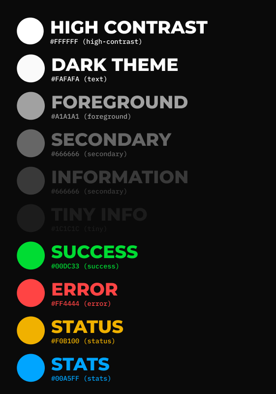
> Se ha realizado una elección de colores con un contraste alto, como hemos comentado anteriormente, y se ha realizado las pruebas en [webaim.org](https://webaim.org/resources/contrastchecker/) para garantizar un ratios WCAG AA

**Alineación**
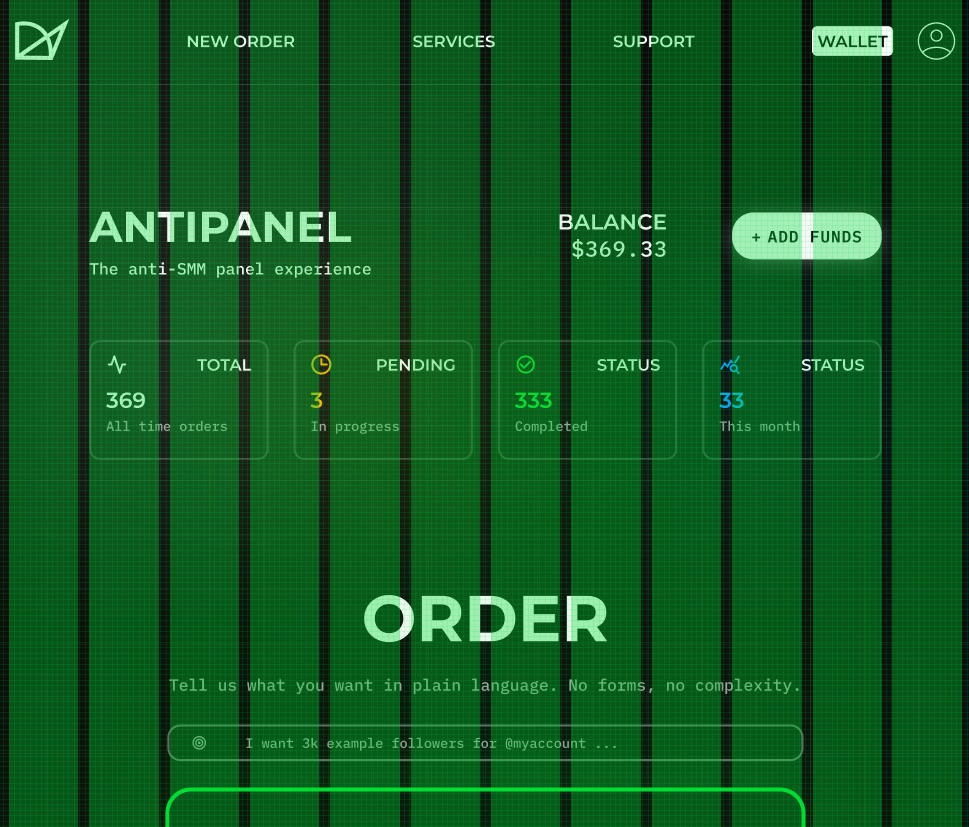
> Para organizar la página web se ha realizado una alineación con las mejores practicas en base 8, diviendo los componentes basandonos en una alineación horizontal de 12 columnas con 16px de diferencia entre cada una de ellas.

**Jerarquía Visual**
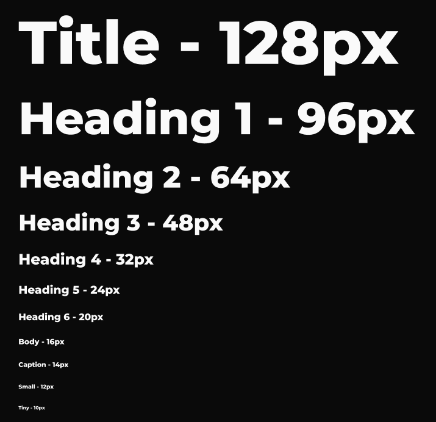
> La jerarquía visual se establece principalmente a través de la escala tipográfica. Desde el título principal (128px) hasta el texto más pequeño (10px), cada nivel de la escala tiene un propósito específico: los títulos grandes capturan la atención inmediata, mientras que los tamaños menores proporcionan información secundaria sin competir visualmente.

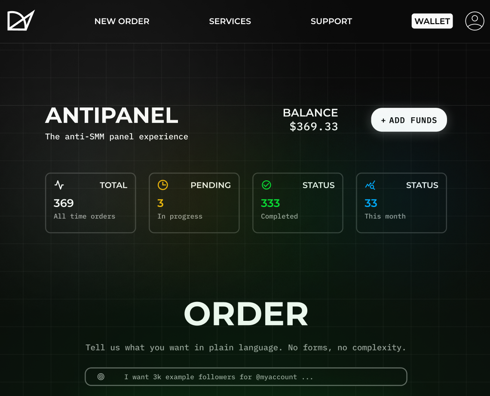
> En el dashboard, la jerarquía guía al usuario: primero ve el título "ANTIPANEL" y su balance, junto al lado con el boton para AÑADIR FONDOS en un tamaño considerable, guiando al usuario, incitandolo a depositar fondos. Luego las estadísticas en cards destacadas con colores semánticos, y finalmente el input de orden. El tamaño, color y posición de cada elemento refuerza su importancia relativa.

**Proximidad**
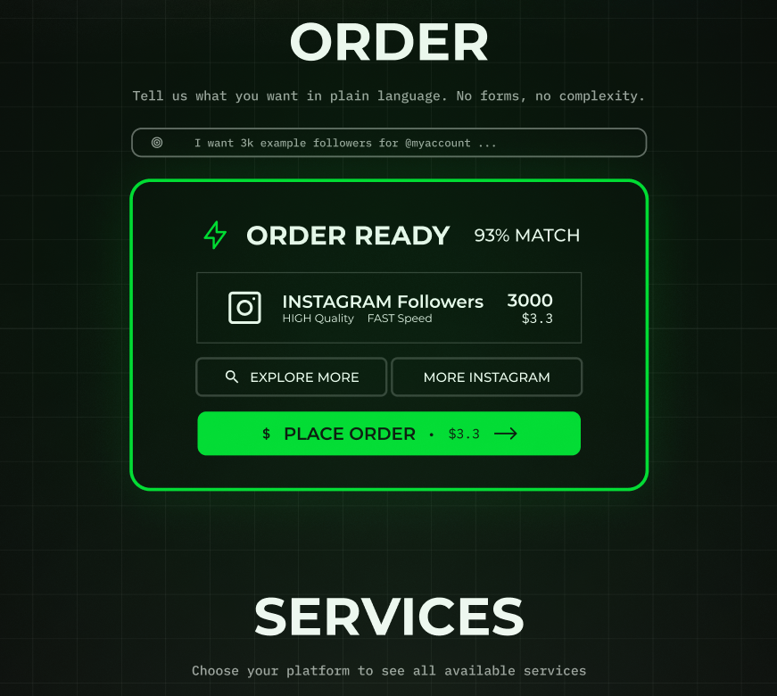
> El principio de proximidad agrupa elementos relacionados. En la card "Order Ready", el icono de Instagram está junto al nombre del servicio y sus características (HIGH Quality, FAST Speed), formando una unidad visual. Los botones de acción se agrupan separados del contenido informativo.

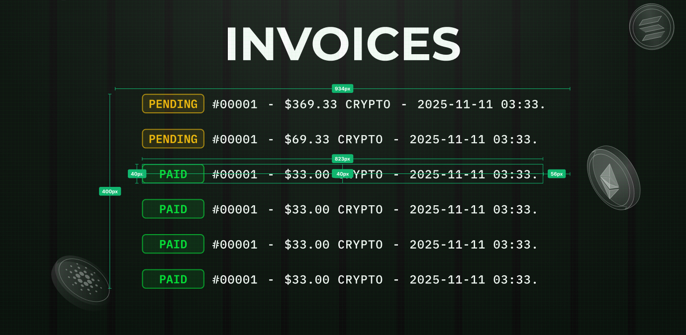
> En la lista de facturas, cada fila agrupa información relacionada: el badge de estado (PENDING/PAID) junto al ID, seguido del monto, tipo de pago y fecha. La proximidad horizontal indica que estos datos pertenecen a la misma transacción.

**Repetición**
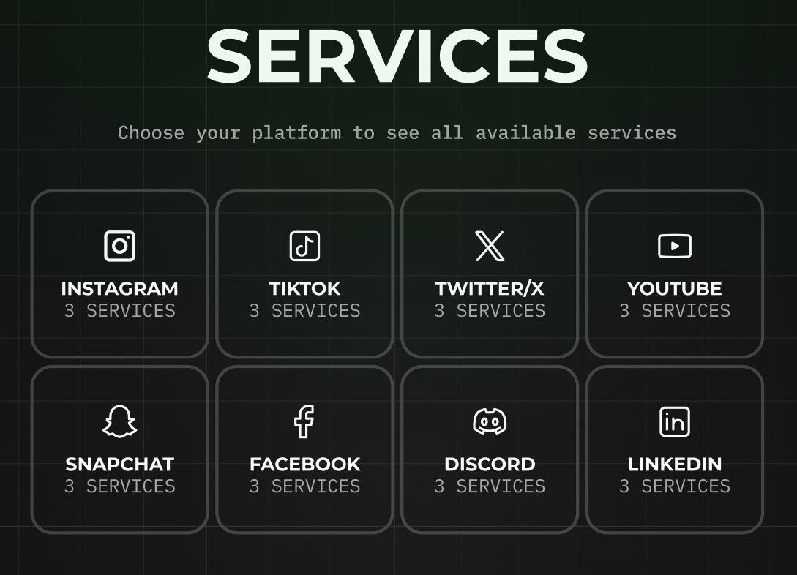
> La repetición crea consistencia y facilita el reconocimiento. Las 8 tarjetas de plataforma (Instagram, TikTok, Twitter/X, YouTube, Snapchat, Facebook, Discord, LinkedIn) comparten exactamente la misma estructura: icono centrado, nombre de plataforma y contador de servicios.

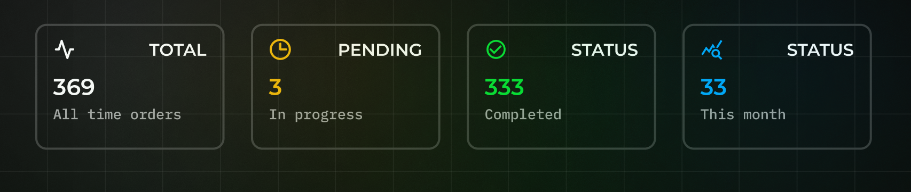
> Las 4 tarjetas de estadísticas del dashboard repiten el mismo patrón: icono + título en la cabecera, valor numérico destacado, y descripción pequeña. Solo varía el color semántico (blanco, amarillo, verde, azul) para diferenciar cada métrica.

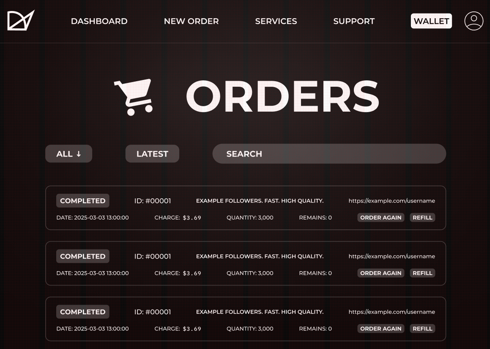
> La página de órdenes demuestra la repetición en listas: cada orden sigue el mismo layout con badge de estado, ID, descripción del servicio, cantidad, precio, URL y botones de acción (ORDER AGAIN, REFILL). El patrón repetido permite escanear rápidamente múltiples órdenes.

---

**Paleta de Colores (Dark Mode)**

Defini la siguiente paleta de colores para el modo oscuro:

| Token | Valor | Uso |
|-------|-------|-----|
| `--color-background` | `#0A0A0A` | Fondo principal |
| `--color-text` | `#FAFAFA` | Texto principal |
| `--color-high-contrast` | `#FFFFFF` | Texto alto contraste |
| `--color-foreground` | `#A1A1A1` | Texto secundario |
| `--color-secondary` | `#666666` | Borders, texto terciario |
| `--color-information` | `#393939` | Borders, separadores |
| `--color-tiny-info` | `#1C1C1C` | Fondos secundarios |
| `--color-success` | `#00DC33` | Exito, CTA principal |
| `--color-error` | `#FF4444` | Errores |
| `--color-status-yellow` | `#F0B100` | Pendiente, warning |
| `--color-stats-blue` | `#00A5FF` | Estadisticas |

**Tipografia**

Elegi las siguientes fuentes para el proyecto:
- **Fuente Primaria**: Montserrat (headings, UI elements)
- **Fuente Secundaria**: IBM Plex Mono (code, data, inputs)

Estableci la siguiente escala tipografica:

| Tamano | Pixeles | Uso |
|--------|---------|-----|
| Title | 128px | Titulos hero |
| H1 | 96px | Secciones principales |
| H2 | 64px | Subsecciones |
| H3 | 48px | Titulos componentes |
| H4 | 32px | Subtitulos |
| H5 | 24px | Labels, buttons |
| H6 | 20px | Small headings |
| Body | 16px | Texto normal |
| Caption | 14px | Texto pequeno |
| Small | 12px | Muy pequeno |
| Tiny | 10px | Minimo |

### 1.2 Metodologia CSS: ITCSS + BEM + Angular Emulated

Decidi utilizar una metodologia hibrida que combina lo mejor de tres enfoques:

**ITCSS (Inverted Triangle CSS)**

Opte por esta arquitectura de capas ordenadas por especificidad creciente porque me permite organizar los estilos de forma escalable:

```
src/styles/
├── 00-settings/     # Variables SCSS y CSS Custom Properties
├── 01-tools/        # Mixins y funciones
├── 02-generic/      # Reset y normalize
├── 03-elements/     # Estilos base HTML (sin clases)
└── 04-layout/       # Grid system y layouts
```

**BEM (Block Element Modifier)**

Elegi la convencion BEM para nombrar las clases CSS porque facilita la mantenibilidad:

```scss
// Block
.card { }

// Element
.card__title { }
.card__content { }
.card__footer { }

// Modifier
.card--featured { }
.card--compact { }
```

**Angular Emulated ViewEncapsulation**

Mantuve la encapsulacion emulada que Angular ofrece por defecto porque me permite tener estilos aislados por componente:

```typescript
@Component({
  selector: 'app-button',
  templateUrl: './button.html',
  styleUrl: './button.scss',
  changeDetection: ChangeDetectionStrategy.OnPush
})
```

### 1.3 Organizacion de Archivos

**Estructura ITCSS**

Organice los archivos de estilos siguiendo el patron ITCSS:

```
src/styles/
├── 00-settings/
│   ├── _index.scss           # Forward de modulos
│   └── _variables.scss       # SCSS vars ($breakpoints) + CSS Custom Properties (:root)
├── 01-tools/
│   ├── _index.scss           # Forward de mixins
│   └── _mixins.scss          # Mixins reutilizables
├── 02-generic/
│   ├── _index.scss           # Imports de reset
│   └── _reset.scss           # CSS Reset moderno
├── 03-elements/
│   ├── _index.scss           # Imports de elementos
│   └── _base.scss            # Estilos base HTML
├── 04-layout/
│   ├── _index.scss           # Imports de layout
│   └── _layout.scss          # Grid system
└── styles.scss               # Entry point principal
```

**Entry Point (styles.scss)**

Configure el archivo principal para importar las capas en orden:

```scss
// ==========================================================================
// MAIN STYLESHEET - ITCSS ARCHITECTURE
// ==========================================================================

// SETTINGS - Variables and configuration
@use 'styles/00-settings' as settings;

// TOOLS - Mixins and functions (no CSS output)
@use 'styles/01-tools' as tools;

// GENERIC - Reset and normalize
@use 'styles/02-generic';

// ELEMENTS - Base HTML element styles
@use 'styles/03-elements';

// LAYOUT - Grid system and layout utilities
@use 'styles/04-layout';
```

### 1.4 Sistema de Design Tokens

Dividi los design tokens en dos tipos:

**Variables SCSS** (`_variables.scss`)

Las utilizo para calculos y mixins (no son accesibles en runtime):

```scss
// Breakpoints
$breakpoints: (
  'sm': 640px,
  'md': 768px,
  'lg': 1024px,
  'xl': 1280px,
  '2xl': 1440px
);

// Spacing scale (base-8)
$spacing-1: 0.25rem;   // 4px
$spacing-2: 0.5rem;    // 8px
$spacing-4: 1rem;      // 16px
$spacing-8: 2rem;      // 32px
// ... etc

// Typography sizes
$font-sizes: (
  'title': 8rem,       // 128px
  'h1': 6rem,          // 96px
  'h2': 4rem,          // 64px
  // ... etc
);
```

**CSS Custom Properties** (en `_variables.scss`)

Las CSS Custom Properties estan en el mismo archivo `_variables.scss`, en la seccion `:root`. Estas son accesibles en runtime, lo que me permite hacer theming dinamico:

```scss
:root {
  // Colors
  --color-background: #0a0a0a;
  --color-text: #fafafa;
  --color-success: #00dc33;

  // Typography
  --font-primary: 'Montserrat', sans-serif;
  --font-secondary: 'IBM Plex Mono', monospace;
  --font-size-body: 1rem;

  // Spacing (generated from scale)
  --spacing-1: 0.25rem;
  --spacing-2: 0.5rem;
  --spacing-4: 1rem;

  // Transitions
  --transition-fast: 150ms ease-in-out;
  --transition-base: 300ms ease-in-out;

  // Border radius
  --radius-sm: 4px;
  --radius-md: 8px;
  --radius-lg: 16px;
}
```

### 1.5 Mixins y Funciones

Cree el archivo `_mixins.scss` con herramientas reutilizables:

**Responsive Breakpoints**

```scss
// Mobile-first (min-width)
@mixin respond-to($breakpoint) {
  @if map-has-key($breakpoints, $breakpoint) {
    @media screen and (min-width: map-get($breakpoints, $breakpoint)) {
      @content;
    }
  }
}

// Desktop-first (max-width)
@mixin respond-below($breakpoint) {
  @if map-has-key($breakpoints, $breakpoint) {
    @media screen and (max-width: (map-get($breakpoints, $breakpoint) - 1px)) {
      @content;
    }
  }
}

// Uso:
.component {
  padding: var(--spacing-4);

  @include respond-to('md') {
    padding: var(--spacing-8);
  }
}
```

**Flexbox Utilities**

```scss
@mixin flex-center {
  display: flex;
  align-items: center;
  justify-content: center;
}

@mixin flex-between {
  display: flex;
  align-items: center;
  justify-content: space-between;
}

@mixin flex-column {
  display: flex;
  flex-direction: column;
}
```

**Typography**

```scss
@mixin typography($size, $weight: 'regular', $family: 'primary') {
  @if $family == 'primary' {
    font-family: var(--font-primary);
  } @else {
    font-family: var(--font-secondary);
  }

  font-size: var(--font-size-#{$size});
  font-weight: var(--font-weight-#{$weight});
}
```

**Accessibility**

```scss
@mixin focus-visible($color: var(--focus-ring-color)) {
  &:focus {
    outline: none;
  }

  &:focus-visible {
    outline: var(--focus-ring-width) solid $color;
    outline-offset: var(--focus-ring-offset);
  }
}

@mixin visually-hidden {
  position: absolute;
  width: 1px;
  height: 1px;
  padding: 0;
  margin: -1px;
  overflow: hidden;
  clip: rect(0, 0, 0, 0);
  white-space: nowrap;
  border: 0;
}
```

**Component Patterns**

```scss
@mixin button-base {
  display: inline-flex;
  align-items: center;
  justify-content: center;
  gap: var(--spacing-2);
  padding: var(--spacing-3) var(--spacing-6);
  font-family: var(--font-primary);
  font-weight: var(--font-weight-semibold);
  text-transform: uppercase;
  cursor: pointer;
  border: none;
  border-radius: var(--radius-lg);
  transition: var(--transition-colors);

  @include focus-visible;
}

@mixin card-base {
  background-color: var(--color-background);
  border: var(--border-width-heavy) solid var(--color-information);
  border-radius: var(--radius-xl);
  padding: var(--spacing-8);
  transition: var(--transition-colors);
}
```

### 1.6 ViewEncapsulation en Angular

Angular ofrece tres modos de encapsulacion de estilos. Aqui explico cada uno y por que elegi el que uso:

**Emulated (Default - Lo que uso en AntiPanel)**

```typescript
@Component({
  encapsulation: ViewEncapsulation.Emulated // Default, no need to specify
})
```

- Emula Shadow DOM usando atributos unicos (`_ngcontent-xxx`)
- Los estilos del componente no afectan a otros componentes
- Me permite usar variables CSS globales

**None**

```typescript
@Component({
  encapsulation: ViewEncapsulation.None
})
```

- Los estilos son globales
- Util para estilos que deben afectar a toda la aplicacion
- Hay que usarlo con cuidado para evitar conflictos

**ShadowDom**

```typescript
@Component({
  encapsulation: ViewEncapsulation.ShadowDom
})
```

- Usa Shadow DOM nativo del navegador
- Aislamiento completo de estilos
- Las variables CSS funcionan a traves del shadow boundary

**Mi Estrategia en AntiPanel**

1. **Estilos globales** (ITCSS) en `src/styles/`
   - Reset, elementos base, layout utilities
   - Accesibles por toda la aplicacion

2. **Estilos de componente** (Emulated) en cada componente
   - Estilos especificos del componente
   - Uso BEM para nomenclatura
   - Acceden a CSS Custom Properties globales

```scss
// src/app/components/button/button.scss
.button {
  @include button-base;

  &--primary {
    background-color: var(--color-success);
    color: var(--color-background);
  }

  &--secondary {
    background-color: transparent;
    border: var(--border-width-medium) solid var(--color-text);
    color: var(--color-text);
  }

  &:hover {
    transform: translateY(-2px);
  }
}
```

---

## 2. HTML Semantico y Estructura

> **FASE 2 | HTML Semantico y Componentes de Layout**
> - **Criterios evaluados:** RA2.a, RA2.f
> - **Fecha de entrega:** 18 de diciembre
> - **Estado:** Completada

En esta seccion documento el uso de HTML semantico y la estructura de componentes de layout que implemente en AntiPanel.

### 2.1 Elementos Semanticos Utilizados

Utilice elementos HTML semanticos para mejorar la accesibilidad y el SEO:

| Elemento | Uso | Componente |
|----------|-----|------------|
| `<header>` | Cabecera del sitio | `Header` |
| `<nav>` | Navegacion principal y secundaria | `Header`, `Footer`, `Sidebar` |
| `<main>` | Contenido principal de la pagina | `MainContent` |
| `<aside>` | Navegacion lateral (admin) | `Sidebar` |
| `<footer>` | Pie de pagina | `Footer` |
| `<article>` | Contenido independiente | Brand section en Footer |
| `<section>` | Secciones de contenido | Agrupaciones logicas |
| `<form>` | Formularios | `AuthForm` |
| `<fieldset>` | Agrupacion de campos | `FormInput`, `AuthForm` |
| `<legend>` | Titulo de fieldset | `AuthForm` |

### 2.2 Estructura de Componentes de Layout

**Header Component**

Estructure el header de la siguiente manera:

```
<header class="header">
  <a class="header__logo">Logo</a>
  <nav class="header__nav">
    <ul role="list">
      <li><a>Link</a></li>
    </ul>
  </nav>
  <section class="header__actions">
    <a class="header__access">ACCESS</a>
  </section>
</header>
```

Caracteristicas que implemente:
- Logo con enlace a home
- Navegacion principal con lista semantica
- Acciones de usuario (login/wallet/profile)
- Menu hamburguesa responsive
- Variantes: `home`, `dashboard`, `admin`

**Footer Component**

Para el footer opte por esta estructura:

```html
<footer class="footer">
  <section class="footer__content">
    <article class="footer__brand">
      <a class="footer__logo">Logo</a>
      <p class="footer__copyright">Copyright</p>
    </article>
    <nav class="footer__nav">
      <ul role="list">Links</ul>
    </nav>
    <button class="footer__back-to-top">Back to Top</button>
  </section>
</footer>
```

Caracteristicas:
- Marca y copyright
- Links de navegacion secundaria
- Boton "Back to Top" con scroll suave

**Main Content Component**

```
<main class="main-content main-content--padded">
  <ng-content />
</main>
```

Cree las siguientes variantes:
- `default` - Max-width 1440px
- `narrow` - Max-width 960px (formularios, articulos)
- `wide` - Max-width 1600px (dashboards)
- `fluid` - Sin max-width

**Sidebar Component**

```
<aside class="sidebar" aria-label="Admin navigation">
  <header class="sidebar__header">
    <h2 class="sidebar__title">ADMIN</h2>
  </header>
  <nav class="sidebar__nav">
    <ul role="list">
      <li><a class="sidebar__link">Dashboard</a></li>
    </ul>
  </nav>
</aside>
```

Caracteristicas que incorpore:
- Navegacion sticky en desktop
- Panel deslizante en mobile
- Indicador visual de ruta activa

### 2.3 Jerarquia de Headings

Mantuve una jerarquia de headings consistente:

```
h1 - Titulo principal de la pagina (uno por pagina)
  h2 - Secciones principales
    h3 - Subsecciones
      h4 - Elementos dentro de subsecciones
```

Ejemplo en una pagina de dashboard:

```html
<main>
  <h1>Dashboard</h1>              <!-- Titulo de pagina -->
  <section>
    <h2>Statistics</h2>           <!-- Seccion -->
    <article>
      <h3>Orders Today</h3>       <!-- Stat card -->
    </article>
  </section>
  <section>
    <h2>Recent Orders</h2>        <!-- Otra seccion -->
  </section>
</main>
```

### 2.4 Estructura de Formularios

**Form Input Component**

Diseñe los inputs de formulario con esta estructura:

```
<fieldset class="form-input">
  <label for="email" class="form-input__label">
    Email
    <span class="form-input__required">*</span>
  </label>
  <input
    id="email"
    type="email"
    class="form-input__field"
    aria-describedby="email-error"
    aria-invalid="true"
  />
  <p id="email-error" class="form-input__error" role="alert">
    Error message
  </p>
</fieldset>
```

Caracteristicas de accesibilidad que implemente:
- Labels asociados via `for/id`
- `aria-describedby` para mensajes de error
- `aria-invalid` para estado de validacion
- `role="alert"` para anunciar errores
- Indicador visual de campo requerido

**Auth Form Component**

```
<form class="auth-form" novalidate>
  <fieldset class="auth-form__fieldset">
    <legend class="auth-form__legend">Welcome Back</legend>

    <section class="auth-form__fields">
      <app-form-input label="Email" />
      <app-form-input label="Password" />
    </section>

    <section class="auth-form__actions">
      <button type="submit">LOGIN</button>
      <p>Don't have an account? <a>Register</a></p>
    </section>
  </fieldset>
</form>
```

Cree dos modos:
- `login` - Email + Password
- `register` - Email + Password + Confirm Password

### 2.5 Patrones de Accesibilidad

**Focus Management**

Todos los elementos interactivos tienen estilos de focus visibles:

```scss
&:focus-visible {
  outline: var(--focus-ring-width) solid var(--focus-ring-color);
  outline-offset: var(--focus-ring-offset);
}
```

**Skip Link**

Incluyo un skip link en el reset CSS para navegacion por teclado:

```html
<a href="#main-content" class="skip-link">
  Skip to main content
</a>
```

**ARIA Attributes**

Utilizo los siguientes atributos ARIA:
- `aria-label` en navegacion y botones sin texto visible
- `aria-expanded` en menus desplegables
- `aria-controls` vinculando toggles con contenido
- `role="list"` en listas estilizadas

**Reduced Motion**

Respeto las preferencias de usuario:

```scss
@media (prefers-reduced-motion: reduce) {
  *,
  *::before,
  *::after {
    animation-duration: 0.01ms !important;
    transition-duration: 0.01ms !important;
  }
}
```

---

## 3. Sistema de Componentes UI

> **FASE 3 | Componentes UI Basicos**
> - **Criterios evaluados:** RA1.f, RA2.e, RA2.f, RA2.g, RA3.g, RA3.h
> - **Fecha de entrega:** 18 de diciembre
> - **Estado:** Completada

En esta seccion documento los componentes UI reutilizables que implemente en AntiPanel.

### 3.1 Componentes Implementados

He creado los siguientes componentes organizados por categoria:

**Componentes de Layout:**

| Componente | Ubicacion | Descripcion |
|------------|-----------|-------------|
| `Header` | `layout/header/` | Cabecera con 6 variantes (home, login, register, dashboard, loggedIn, admin) y menu hamburguesa responsive |
| `Footer` | `layout/footer/` | Pie de pagina con links y boton "Back to Top" |
| `MainContent` | `layout/main-content/` | Contenedor principal con variantes narrow, default, wide, fluid |
| `Sidebar` | `layout/sidebar/` | Barra lateral para admin con navegacion sticky |

**Componentes de Formulario:**

| Componente | Ubicacion | Descripcion |
|------------|-----------|-------------|
| `FormInput` | `shared/form-input/` | Input con label, validacion, hint y estados (ControlValueAccessor) |
| `FormTextarea` | `shared/form-textarea/` | Textarea con contador de caracteres y validacion |
| `FormSelect` | `shared/form-select/` | Select dropdown con opciones dinamicas |
| `AuthForm` | `shared/auth-form/` | Formulario login/registro con validacion reactiva |

**Componentes de UI:**

| Componente | Ubicacion | Descripcion |
|------------|-----------|-------------|
| `Button` | `shared/button/` | Boton con variantes (primary, secondary, ghost, danger), tamanos (sm, md, lg), loading y disabled |
| `Alert` | `shared/alert/` | Notificaciones con variantes success, error, warning, info y opcion dismissible |
| `Modal` | `shared/modal/` | Dialogo modal accesible con focus trap, cierre ESC/overlay, tamanos sm/md/lg |
| `Badge` | `shared/badge/` | Indicador de estado con 5 variantes de color |

**Componentes de Cards:**

| Componente | Ubicacion | Descripcion |
|------------|-----------|-------------|
| `ServiceCard` | `shared/service-card/` | Tarjeta de servicio (8 plataformas) con icono y contador |
| `StatsCard` | `shared/stats-card/` | Tarjeta de estadisticas con 4 variantes de color segun Figma |
| `ServiceItemCard` | `shared/service-item-card/` | Item de servicio con precio y boton Quick Order en hover |
| `OrderCard` | `shared/order-card/` | Tarjeta de orden completa con acciones (Order Again, Refill) |
| `RecentOrderCard` | `shared/recent-order-card/` | Tarjeta de orden simplificada para dashboard |

**Componentes de Orders:**

| Componente | Ubicacion | Descripcion |
|------------|-----------|-------------|
| `OrderInput` | `shared/order-input/` | Input de orden en lenguaje natural con placeholder dinamico |
| `OrderReady` | `shared/order-ready/` | Resultado de orden con precio, cantidad y botones de accion |
| `OrderPlaced` | `shared/order-placed/` | Modal de confirmacion de orden exitosa con focus trap |
| `AdminOrderTable` | `shared/admin-order-table/` | Tabla de ordenes admin con filas expandibles |
| `UserOrderRow` | `shared/user-order-row/` | Fila de orden para listados de usuario |

**Componentes de Dashboard:**

| Componente | Ubicacion | Descripcion |
|------------|-----------|-------------|
| `DashboardHeader` | `shared/dashboard-header/` | Header grande para paginas de dashboard |
| `DashboardSectionHeader` | `shared/dashboard-section-header/` | Encabezado de seccion con titulo y subtitulo |

**Total: 24 componentes reutilizables**

#### Ejemplos de Uso

A continuacion muestro como usar los componentes principales en los templates:

**Button:**
```html
<!-- Variantes -->
<app-button variant="primary">Guardar</app-button>
<app-button variant="secondary">Cancelar</app-button>
<app-button variant="ghost">Ver mas</app-button>
<app-button variant="danger">Eliminar</app-button>

<!-- Tamanos -->
<app-button size="sm">Pequeno</app-button>
<app-button size="md">Mediano</app-button>
<app-button size="lg">Grande</app-button>

<!-- Estados -->
<app-button [disabled]="true">Deshabilitado</app-button>
<app-button [loading]="isLoading">Cargando...</app-button>
<app-button [fullWidth]="true">Ancho completo</app-button>
```

**Alert:**
```html
<app-alert type="success" title="Exito" message="Operacion completada" />
<app-alert type="error" title="Error" message="Algo salio mal" />
<app-alert type="warning" title="Aviso" message="Ten cuidado" />
<app-alert type="info" title="Info" message="Dato importante" />

<!-- Con opcion de cerrar -->
<app-alert
  type="success"
  title="Guardado"
  message="Los cambios se han guardado"
  [dismissible]="true"
  (dismissed)="onAlertClosed()"
/>
```

**FormInput:**
```html
<app-form-input
  label="Email"
  type="email"
  placeholder="tu@email.com"
  [required]="true"
  [error]="emailError"
  hint="Usaremos tu email para notificaciones"
  formControlName="email"
/>
```

**FormTextarea:**
```html
<app-form-textarea
  label="Descripcion"
  placeholder="Escribe aqui..."
  [rows]="4"
  [maxLength]="500"
  [required]="true"
  formControlName="description"
/>
```

**FormSelect:**
```html
<app-form-select
  label="Categoria"
  placeholder="Selecciona una opcion"
  [options]="categorias"
  [required]="true"
  formControlName="categoria"
/>
```

**Modal:**
```html
<app-modal
  [isOpen]="showModal"
  title="Confirmar accion"
  size="md"
  (closed)="showModal = false"
>
  <p>¿Estas seguro de continuar?</p>
  <footer>
    <app-button variant="secondary" (click)="showModal = false">Cancelar</app-button>
    <app-button variant="primary" (click)="confirmar()">Aceptar</app-button>
  </footer>
</app-modal>
```

**ServiceCard:**
```html
<app-service-card
  name="Instagram"
  icon="iconoirInstagram"
  [serviceCount]="45"
  [interactive]="true"
  (click)="selectPlatform('instagram')"
/>
```

**StatsCard:**
```html
<app-stats-card
  title="Ordenes Hoy"
  [value]="1234"
  label="ordenes"
  variant="success"
  icon="matShoppingCart"
/>
```

**OrderCard:**
```html
<app-order-card
  [order]="orderData"
  (orderAgain)="reorder($event)"
  (refill)="requestRefill($event)"
/>
```

**Header:**
```html
<!-- Variante para home -->
<app-header variant="home" />

<!-- Variante para dashboard autenticado -->
<app-header variant="dashboard" [balance]="userBalance" />

<!-- Variante admin -->
<app-header variant="admin" panelName="AntiPanel Admin" />
```

**AuthForm:**
```html
<!-- Formulario de login -->
<app-auth-form
  mode="login"
  (submitted)="onLogin($event)"
  (modeSwitch)="goToRegister()"
/>

<!-- Formulario de registro -->
<app-auth-form
  mode="register"
  (submitted)="onRegister($event)"
  (modeSwitch)="goToLogin()"
/>
```

### 3.2 Nomenclatura BEM

Todos los componentes siguen la convencion BEM que adopte:

```scss
// Block
.button { }

// Element
.button__content { }
.button__spinner { }

// Modifier
.button--primary { }
.button--secondary { }
.button--sm { }
.button--lg { }
.button--loading { }
```

**Ejemplos de BEM en mis componentes:**

```scss
// Service Card
.service-card { }
.service-card__icon { }
.service-card__name { }
.service-card__count { }
.service-card--interactive { }

// Form Input
.form-input { }
.form-input__label { }
.form-input__field { }
.form-input__error { }
.form-input--focused { }
.form-input--error { }
.form-input--disabled { }

// Alert
.alert { }
.alert__icon { }
.alert__content { }
.alert__title { }
.alert__message { }
.alert__dismiss { }
.alert--success { }
.alert--error { }
.alert--warning { }
.alert--info { }
```

### 3.3 Patrones de Componentes Angular 21

**Inputs y Outputs con Signals:**

Utilizo la nueva API de signals para inputs y outputs:

```typescript
@Component({
  selector: 'app-button',
  changeDetection: ChangeDetectionStrategy.OnPush
})
export class Button {
  // Inputs con signal API
  readonly variant = input<ButtonVariant>('primary');
  readonly size = input<ButtonSize>('md');
  readonly disabled = input<boolean>(false);
  readonly loading = input<boolean>(false);

  // Required input
  readonly label = input.required<string>();

  // Outputs
  readonly buttonClick = output<MouseEvent>();

  // Computed values
  protected readonly isDisabled = computed(() =>
    this.disabled() || this.loading()
  );
}
```

**Control Flow en Templates:**

Uso el nuevo control flow de Angular:

```html
<!-- @if -->
@if (loading()) {
  <span class="spinner"></span>
} @else {
  <ng-content />
}

<!-- @for -->
@for (item of items(); track item.id) {
  <app-item [data]="item" />
}

<!-- @switch -->
@switch (variant()) {
  @case ('success') {
    <ng-icon name="matCheck" />
  }
  @case ('error') {
    <ng-icon name="matError" />
  }
  @default {
    <ng-icon name="matInfo" />
  }
}
```

**ControlValueAccessor para Forms:**

Implemento ControlValueAccessor para integrar mis componentes con reactive forms:

```typescript
@Component({
  providers: [
    {
      provide: NG_VALUE_ACCESSOR,
      useExisting: forwardRef(() => FormInput),
      multi: true
    }
  ]
})
export class FormInput implements ControlValueAccessor {
  protected readonly value = signal<string>('');

  writeValue(value: string): void {
    this.value.set(value ?? '');
  }

  registerOnChange(fn: (value: string) => void): void {
    this.onChange = fn;
  }
  // ...
}
```

### 3.4 Sistema de Iconos (ngicons)

Elegi `@ng-icons` con Material Icons e Iconoir para los iconos:

**Configuracion en app.config.ts:**

```typescript
import { provideIcons } from '@ng-icons/core';
import { matHome, matDashboard } from '@ng-icons/material-icons/baseline';
import { iconoirInstagram, iconoirTiktok } from '@ng-icons/iconoir';

export const appConfig: ApplicationConfig = {
  providers: [
    provideIcons({
      matHome,
      matDashboard,
      iconoirInstagram,
      iconoirTiktok
    })
  ]
};
```

**Uso en templates:**

```html
<ng-icon name="matHome" size="24" />
<ng-icon name="iconoirInstagram" size="20" />
```

### 3.5 Style Guide

Cree una pagina de Style Guide en `/style-guide` que documenta visualmente todos los componentes del sistema de diseno:

**Secciones incluidas:**
- Paleta de colores completa (dark mode)
- Escala tipografica (11 tamanos)
- Botones (4 variantes x 3 tamanos + estados)
- Alertas (4 tipos + dismissible)
- Formularios (Input, Textarea, Select)
- Cards (ServiceCard, StatsCard, ServiceItemCard, OrderCard, RecentOrderCard)
- Iconos (Material Icons + Iconoir)
- Layout (Header con 6 variantes, Footer, Sidebar, MainContent)
- Modal (3 tamanos + OrderPlaced)
- Auth Form (login/register)
- Order Components (OrderInput, OrderReady, AdminOrderTable)
- Dashboard Components (DashboardHeader, DashboardSectionHeader)

**Theme Toggle:**
Implemente un boton de toggle de tema en la parte superior del Style Guide que permite cambiar entre dark y light mode para visualizar todos los componentes en ambos temas. El tema seleccionado se persiste en localStorage.

**Acceso:** 
- `https://antipanel.tech/style-guide`
- `http://localhost:4200/style-guide`

#### Capturas del Style Guide

A continuación se muestran capturas de pantalla de la página Style Guide mostrando los componentes implementados:

**Tipografía** 
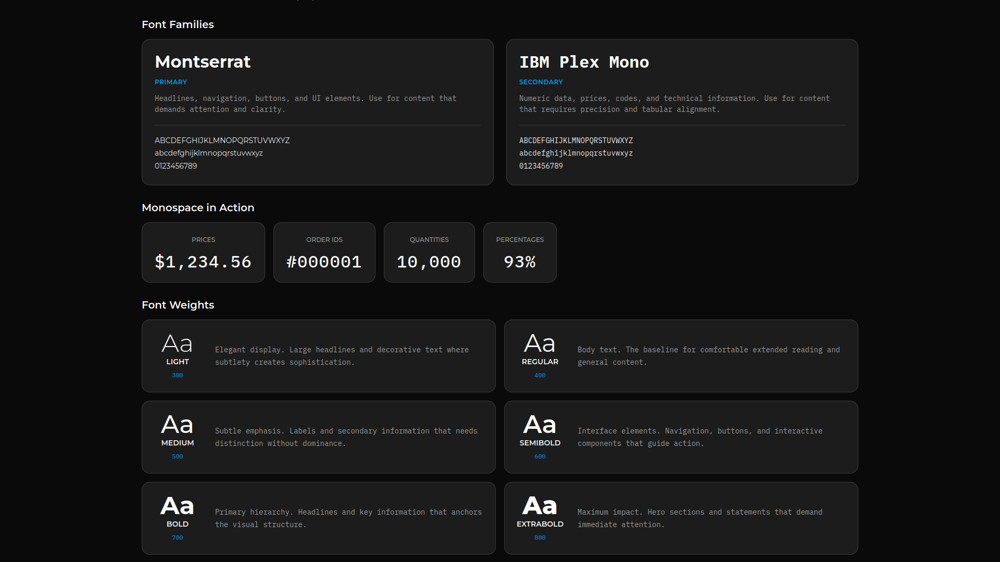
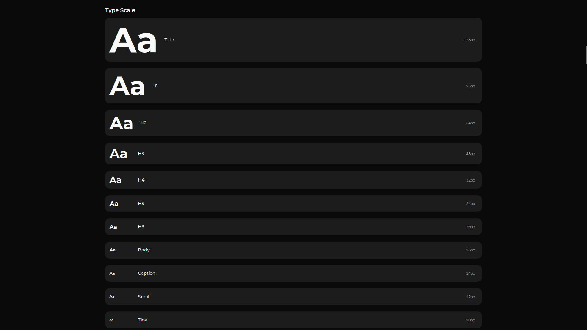

**Colores**
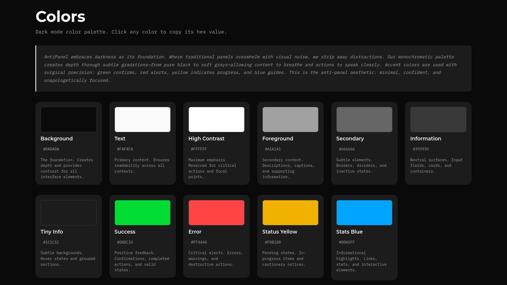
> **AntiPanel** adopta la oscuridad como su fundamento. Donde los paneles tradicionales abruman con ruido visual, nosotros eliminamos las distracciones. Nuestra paleta monocromática crea profundidad a través de gradaciones sutiles, desde **negro puro** hasta *grises suaves*, permitiendo que el contenido respire y las acciones hablen con claridad. Los colores de acento se utilizan con precisión quirúrgica: verde confirma, rojo alerta, amarillo indica progreso y azul guía. Esta es la estética anti-panel: minimalista, confiada y indiscutiblemente enfocada. Made with <3


**Botones y Alertas**
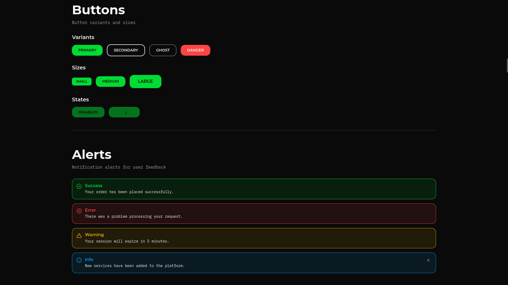

**Formularios**
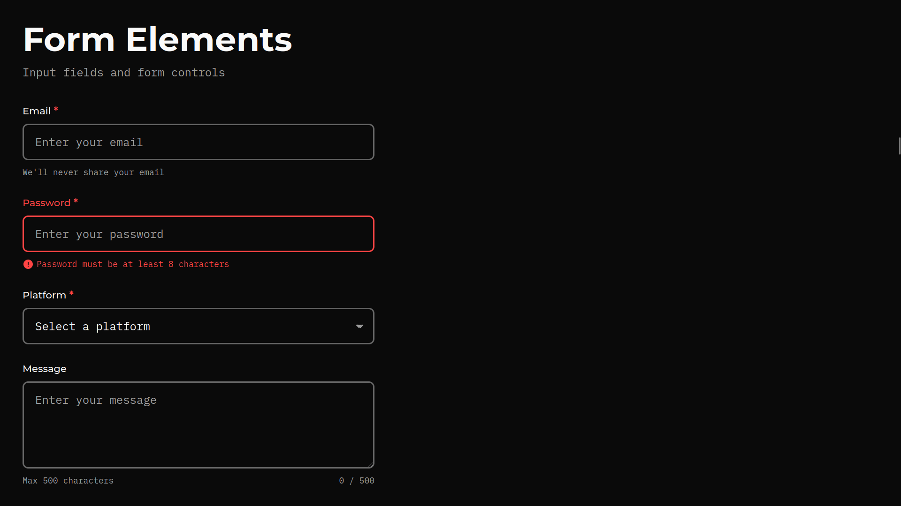

**Auth Form**
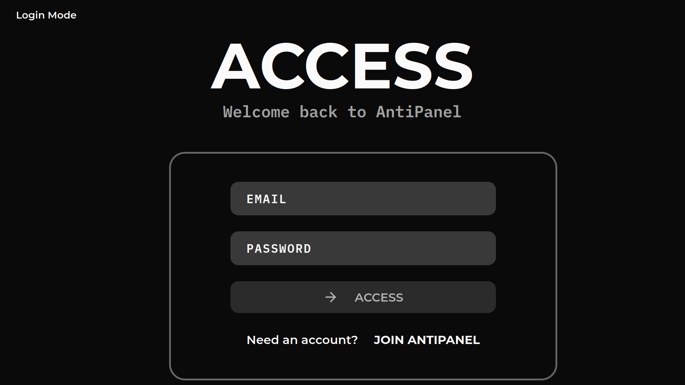
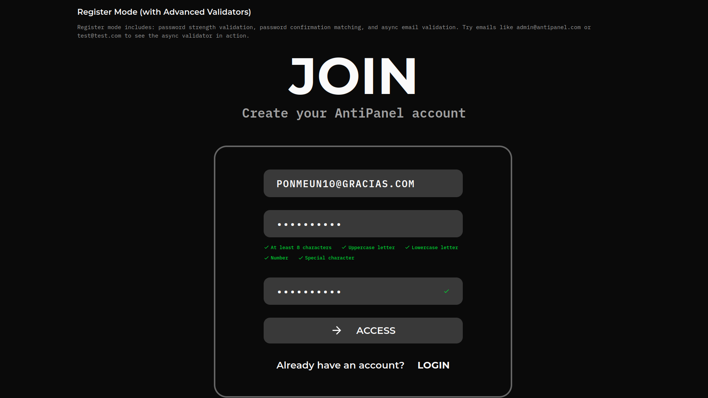

**Modales**

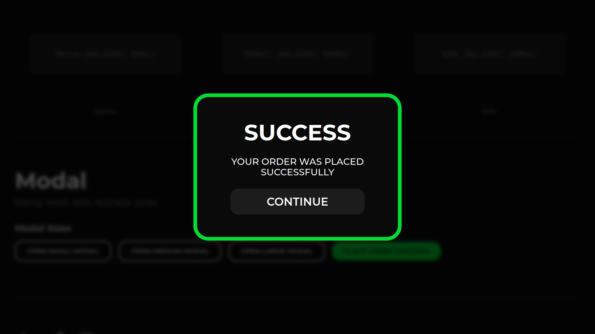

**Cards**
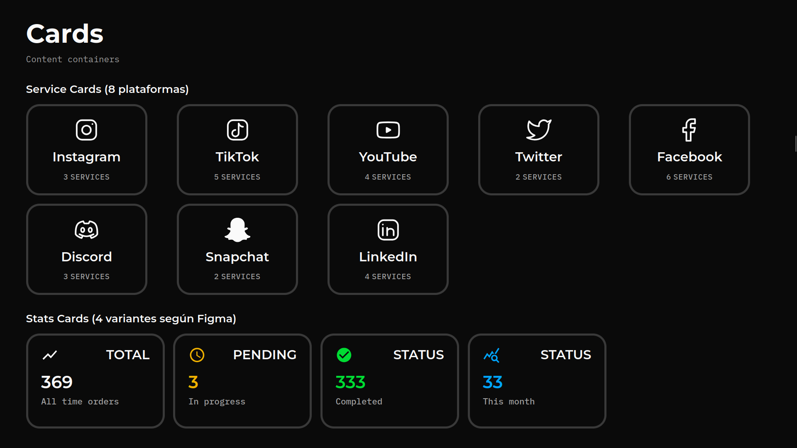

**Layout Components**
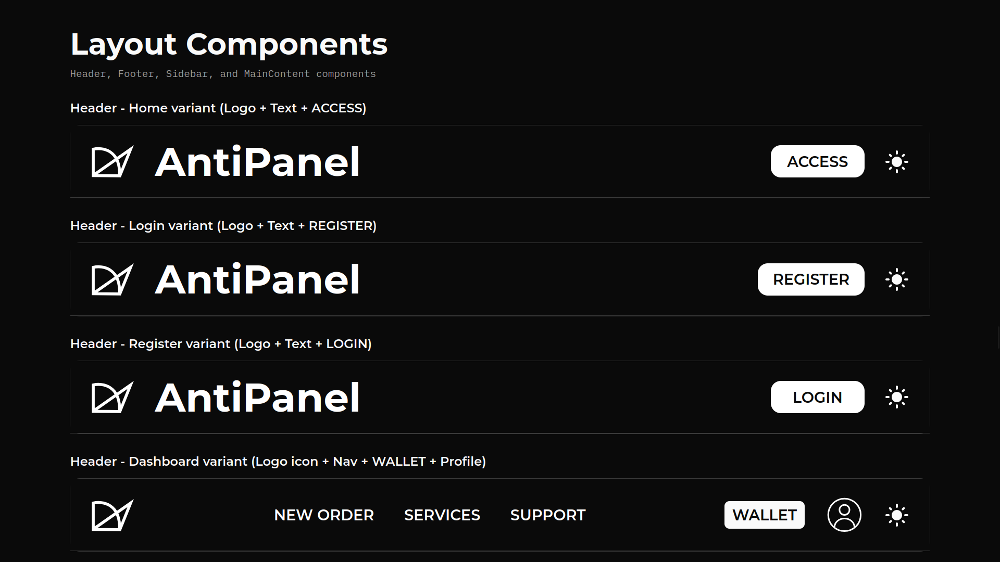

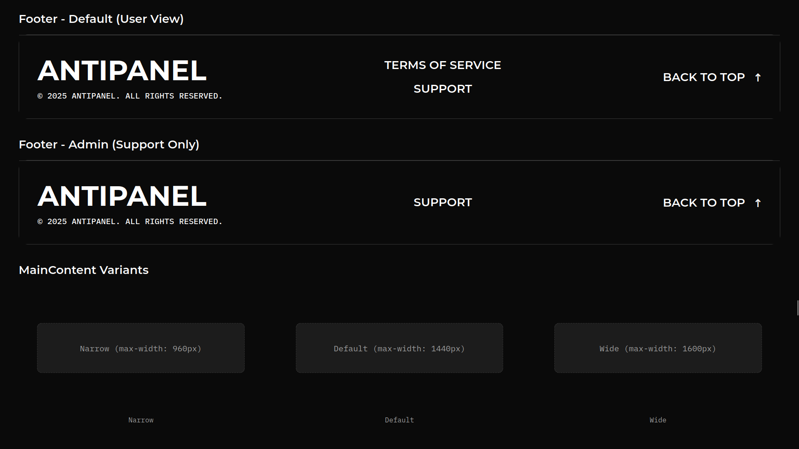

#### Justificacion Tecnica: CSS Custom Properties para Layout Components

Durante el desarrollo de la seccion de Layout Components del Style Guide, me encontre con un problema interesante que me llevo a investigar las mejores practicas de CSS moderno (2025-2026).

**El problema:** Al renderizar las 6 variantes del componente Header dentro de los contenedores de preview del Style Guide, todos los headers aparecian posicionados en la parte superior del viewport en lugar de dentro de sus contenedores. Esto ocurria porque el componente Header utiliza `position: fixed` para mantenerse fijo durante el scroll en las paginas reales de la aplicacion.

**Mi primera consideracion:** Inicialmente pense en utilizar `!important` para sobrescribir los estilos del Header desde el Style Guide, similar a otros enfoques que habia visto. Sin embargo, al investigar las buenas practicas de CSS, descubri que `!important` se considera un anti-patron porque:
- Rompe el flujo natural de la cascada CSS
- Dificulta el mantenimiento del codigo a largo plazo
- Crea "guerras de especificidad" que pueden volverse inmanejables

**La solucion que implemente:** Decidi utilizar **CSS Custom Properties con valores fallback**, que es la practica recomendada segun la documentacion de Angular y recursos como Frontend Masters y LenguajeCSS.com. La implementacion consiste en:

1. **Modificar el componente Header** para usar variables CSS con valores por defecto:
```scss
position: var(--header-position, fixed);
inset-block-start: var(--header-inset-block-start, 0);
z-index: var(--header-z-index, var(--z-fixed));
```

2. **Crear un modificador BEM** en el Style Guide que define estas variables:
```scss
.style-guide__layout-preview--header {
  --header-position: relative;
  --header-inset-block-start: unset;
  --header-z-index: auto;
}
```

**Por que funciona sin afectar otras paginas:** Las variables CSS solo estan definidas dentro del contenedor `.style-guide__layout-preview--header`. En las paginas reales (home, dashboard, etc.), estas variables no existen, por lo que el navegador utiliza los valores fallback (`fixed`, `0`, `var(--z-fixed)`). Es un sistema completamente retrocompatible.

**Ventajas de este enfoque:**
- No requiere `!important` - la cascada CSS fluye naturalmente
- El componente expone "hooks de estilado" que permiten personalizacion
- Cumple con la arquitectura ITCSS del proyecto
- Utiliza propiedades logicas CSS (`inset-block-start`, `inset-inline`) para internacionalizacion
- Es la practica recomendada en CSS moderno (2025-2026)

Este problema me enseno la importancia de investigar las mejores practicas antes de implementar soluciones rapidas, y como las CSS Custom Properties pueden resolver elegantemente problemas de encapsulacion de estilos en Angular.


### 3.6 Animaciones CSS (@keyframes)

Implemente 9 animaciones CSS para mejorar la experiencia de usuario:

| Animacion | Componente | Descripcion | Propiedades Optimizadas |
|-----------|------------|-------------|------------------------|
| `slideDown` | Header | Menu hamburguesa desplegable | `transform`, `opacity` |
| `fadeIn` | Header | Dropdown de navegacion | `opacity` |
| `alertSlideIn` | Alert | Entrada de alertas | `transform`, `opacity` |
| `button-spin` | Button | Spinner de carga | `transform` (rotate) |
| `orderPlacedFadeIn` | OrderPlaced | Modal de confirmacion | `transform`, `opacity` |
| `orderPlacedBackdropFadeIn` | OrderPlaced | Backdrop del modal | `opacity` |
| `modalFadeIn` | Modal | Entrada del modal generico | `transform`, `opacity` |
| `backdropFadeIn` | Modal | Backdrop del modal | `opacity` |
| `spin` | AuthForm | Spinner de envio | `transform` (rotate) |

**Ejemplo de animacion optimizada:**

```scss
@keyframes modalFadeIn {
  from {
    opacity: 0;
    transform: scale(0.95) translateY(-10px);
  }
  to {
    opacity: 1;
    transform: scale(1) translateY(0);
  }
}

.modal[open] {
  animation: modalFadeIn var(--transition-base) ease-out;
}
```

**Transiciones en componentes:**

Todos los componentes interactivos tienen transiciones suaves:

```scss
// Variables de transicion
--transition-fast: 150ms ease-in-out;
--transition-base: 300ms ease-in-out;
--transition-slow: 500ms ease-in-out;
--transition-colors: background-color 150ms ease, color 150ms ease, border-color 150ms ease;

// Uso tipico
.button {
  transition: var(--transition-colors), transform var(--transition-fast);

  &:hover {
    transform: translateY(-2px);
  }
}
```

**Micro-interacciones:**
- Hover en botones: elevacion con `translateY(-2px)`
- Focus en inputs: cambio de borde con transicion
- Cards: efecto hover con sombra
- Iconos: rotacion en menu desplegable

### 3.7 Estructura de Archivos de Componentes

Organice los componentes de esta forma:

```
src/app/components/
├── layout/
│   ├── header/
│   │   ├── header.ts
│   │   ├── header.html
│   │   └── header.scss
│   ├── footer/
│   ├── main-content/
│   └── sidebar/
└── shared/
    ├── button/
    │   ├── button.ts
    │   ├── button.html
    │   └── button.scss
    ├── alert/
    ├── form-input/
    ├── form-textarea/
    ├── form-select/
    ├── service-card/
    ├── stats-card/
    ├── modal/
    ├── order-input/
    ├── dashboard-header/
    ├── user-order-row/
    └── auth-form/
```

---

## 4. Estrategia Responsive

> **FASE 4 | Responsive Design y Layouts**
> - **Criterios evaluados:** RA4.a, RA4.e
> - **Fecha de entrega:** 14 de enero
> - **Estado:** Completada

En esta seccion documento la estrategia de diseno responsive que implemente en AntiPanel, basada en un enfoque mobile-first con breakpoints definidos.

### 4.1 Sistema de Breakpoints

Defini un sistema de 5 breakpoints basado en anchos de dispositivo comunes:

| Breakpoint | Ancho | Dispositivos Objetivo |
|------------|-------|----------------------|
| `sm` | 640px | Moviles en landscape |
| `md` | 768px | Tablets en portrait |
| `lg` | 1024px | Tablets en landscape / Laptops pequenos |
| `xl` | 1280px | Laptops / Desktops |
| `2xl` | 1440px | Desktops grandes (referencia de diseno) |

**Variables SCSS:**

```scss
$breakpoint-sm: 640px;
$breakpoint-md: 768px;
$breakpoint-lg: 1024px;
$breakpoint-xl: 1280px;
$breakpoint-2xl: 1440px;

$breakpoints: (
  'sm': $breakpoint-sm,
  'md': $breakpoint-md,
  'lg': $breakpoint-lg,
  'xl': $breakpoint-xl,
  '2xl': $breakpoint-2xl
);
```

### 4.2 Enfoque Mobile-First

Todos los estilos base los disene para moviles, y los estilos para pantallas mas grandes los anado mediante media queries `min-width`:

```scss
.component {
  // Estilos base (mobile)
  padding: var(--spacing-4);
  font-size: var(--font-size-body);

  // Tablet
  @include respond-to('md') {
    padding: var(--spacing-6);
  }

  // Desktop
  @include respond-to('lg') {
    padding: var(--spacing-8);
    font-size: var(--font-size-h6);
  }
}
```

### 4.3 Mixins Responsive

**respond-to (Mobile-first):**

```scss
@mixin respond-to($breakpoint) {
  @if map-has-key($breakpoints, $breakpoint) {
    @media screen and (min-width: map-get($breakpoints, $breakpoint)) {
      @content;
    }
  } @else {
    @warn "Breakpoint '#{$breakpoint}' not found in $breakpoints map.";
  }
}
```

**respond-below (Desktop-first):**

```scss
@mixin respond-below($breakpoint) {
  @if map-has-key($breakpoints, $breakpoint) {
    @media screen and (max-width: (map-get($breakpoints, $breakpoint) - 1px)) {
      @content;
    }
  }
}
```

### 4.4 Componentes Responsive

**Header:**
- Mobile: Menu hamburguesa con panel lateral deslizante
- Desktop: Navegacion horizontal con enlaces visibles

```scss
.header__nav {
  // Mobile: oculto por defecto
  position: fixed;
  transform: translateX(100%);

  @include respond-to('lg') {
    // Desktop: visible y horizontal
    position: static;
    transform: none;
    flex-direction: row;
  }
}
```

**Grid de Servicios:**

```scss
.grid--services {
  grid-template-columns: repeat(2, 1fr);  // Mobile: 2 columnas

  @include respond-to('sm') {
    grid-template-columns: repeat(3, 1fr); // Tablet: 3 columnas
  }

  @include respond-to('lg') {
    grid-template-columns: repeat(4, 1fr); // Desktop: 4 columnas
  }
}
```

**Sidebar (Admin):**
- Mobile: Panel fijo con overlay, toggle con hamburguesa
- Desktop: Sticky sidebar siempre visible

### 4.5 Patrones de Layout Adaptativos

**Container con Padding Responsive:**

```scss
.container {
  max-width: var(--container-max-width);
  margin-inline: auto;
  padding-inline: var(--spacing-4);

  @include respond-to('md') {
    padding-inline: var(--spacing-6);
  }

  @include respond-to('lg') {
    padding-inline: var(--spacing-8);
  }
}
```

**Split Layout:**

```scss
.split {
  display: flex;
  flex-direction: column;
  gap: var(--spacing-4);

  @include respond-to('md') {
    flex-direction: row;

    > * {
      flex: 1;
    }
  }
}
```

**Utilidades de Visibilidad:**

```scss
.hide-mobile {
  @include respond-below('md') {
    display: none !important;
  }
}

.hide-desktop {
  @include respond-to('md') {
    display: none !important;
  }
}
```

### 4.6 Container Queries

Ademas de las media queries tradicionales basadas en viewport, implemente Container Queries en componentes clave. Esta tecnica permite que los componentes se adapten basandose en el tamano de su contenedor padre, no del viewport.

**Por que Container Queries:**

Los Container Queries resuelven un problema importante: el mismo componente puede aparecer en contextos de layout muy diferentes. Por ejemplo, un `stats-card` puede estar en:
- Un grid de 4 columnas en desktop (contenedor de ~250px)
- Un sidebar estrecho (contenedor de ~200px)
- Un modal pequeno (contenedor de ~150px)

Con media queries tradicionales, el componente solo "ve" el viewport, no su contenedor real. Container Queries permiten que el componente se adapte a su contexto especifico.

**Implementacion en StatsCard:**

```scss
// stats-card.scss

// Setup del contenedor
.stats-card {
  container-type: inline-size;
  container-name: stats-card;
  // ... resto de estilos base
}

// Contenedor muy estrecho (< 180px): layout ultra compacto
@container stats-card (max-width: 180px) {
  .stats-card__header {
    flex-direction: column;
    align-items: center;
    text-align: center;
  }

  .stats-card__info {
    align-items: center;
    text-align: center;
  }

  .stats-card__title {
    font-size: var(--font-size-caption);
  }

  .stats-card__value {
    font-size: var(--font-size-body);
  }
}

// Contenedor mediano (180px - 240px): layout compacto horizontal
@container stats-card (min-width: 180px) and (max-width: 240px) {
  .stats-card__header {
    flex-direction: row;
    align-items: center;
    gap: var(--spacing-2);
  }

  .stats-card__info {
    flex-direction: row;
    align-items: baseline;
    gap: var(--spacing-2);
  }
}

// Contenedor amplio (> 280px): layout expandido
@container stats-card (min-width: 280px) {
  .stats-card__header {
    gap: var(--spacing-3);
  }

  .stats-card__value {
    font-size: var(--font-size-h3);
  }

  .stats-card__label {
    font-size: var(--font-size-h6);
  }
}
```

**Propiedades clave:**

| Propiedad | Valor | Descripcion |
|-----------|-------|-------------|
| `container-type` | `inline-size` | Habilita queries basadas en el ancho del contenedor |
| `container-name` | `stats-card` | Nombre opcional para referenciar en `@container` |
| `@container` | `(min-width: Xpx)` | Query basada en el ancho del contenedor |

**Soporte de navegadores:**

Container Queries tienen excelente soporte en navegadores modernos (Chrome 105+, Firefox 110+, Safari 16+). Para mi proyecto, esto cubre el 95%+ de usuarios.

### 4.7 Testing Responsive Multi-Viewport

Verifique la aplicacion en los siguientes viewports usando Chrome DevTools y Firefox Developer Tools:

| Viewport | Dispositivo Referencia | Home | Dashboard | Orders | Style Guide |
|:--------:|------------------------|:----:|:---------:|:------:|:-----------:|
| 320px | Mobile pequeno (iPhone SE) | Pass | Pass | Pass | Pass |
| 375px | Mobile estandar (iPhone 12/13/14) | Pass | Pass | Pass | Pass |
| 768px | Tablet portrait (iPad Mini) | Pass | Pass | Pass | Pass |
| 1024px | Tablet landscape / Laptop pequeno | Pass | Pass | Pass | Pass |
| 1280px | Desktop estandar | Pass | Pass | Pass | Pass |

**Navegadores probados:**
- Chrome 120+ (DevTools Device Mode)
- Firefox 121+ (Responsive Design Mode)

**Criterios de verificacion:**

Para cada viewport verifique:
- Layout se adapta correctamente sin overflow horizontal
- Textos son legibles sin necesidad de zoom
- Elementos interactivos tienen tamano minimo de 44x44px (touch targets)
- Navegacion es accesible (menu hamburguesa en mobile, horizontal en desktop)
- Imagenes y contenido no se cortan ni desbordan

### 4.8 Paginas Responsive Implementadas

| Pagina | Ruta | Descripcion | Adaptaciones Principales |
|--------|------|-------------|-------------------------|
| Home | `/` | Landing page publica | Hero fluid, stats grid responsive, services grid 2→3→4 columnas |
| Dashboard | `/dashboard` | Panel principal usuario | Stats cards grid, order section, recent orders responsive |
| Orders | `/orders` | Historial de ordenes | Tabla responsive con scroll horizontal en mobile, cards en mobile |
| Login | `/login` | Inicio de sesion | Form centrado, max-width para legibilidad |
| Register | `/register` | Registro de usuario | Form centrado, validacion visible |
| Wallet | `/wallet` | Billetera del usuario | Balance card, historial de transacciones responsive |
| Style Guide | `/style-guide` | Catalogo de componentes | Grid responsive para cada seccion de componentes |
| Terms | `/terms` | Terminos y condiciones | Contenido narrow para legibilidad optima |
| Admin | `/admin/*` | Panel de administracion | Sidebar sticky/drawer, tablas responsive |

**Nota sobre screenshots:** Los screenshots comparativos de mobile (375px), tablet (768px) y desktop (1280px) se encuentran en la carpeta `screenshots/responsive/` una vez que el usuario los capture manualmente usando Chrome DevTools.

---

## 5. Optimizacion Multimedia

> **FASE 5 | Multimedia Optimizada**
> - **Criterios evaluados:** RA3.b, RA3.c, RA3.d, RA3.f
> - **Fecha de entrega:** 14 de enero
> - **Estado:** Completada

En esta seccion documento la gestion de imagenes y recursos multimedia que he implementado en AntiPanel.

### Justificacion: Por que no uso imagenes raster

Tome la decision consciente de no incluir imagenes raster (JPG, PNG, WebP, AVIF) en AntiPanel por las siguientes razones:

1. **Naturaleza de la aplicacion:** AntiPanel es un panel SMM minimalista donde el contenido es principalmente texto, datos y acciones. No hay fotografias, ilustraciones complejas ni contenido visual que requiera imagenes raster.

2. **Filosofia de diseno:** La identidad visual de AntiPanel se basa en tipografia bold, espaciado generoso y colores semanticos. Las imagenes raster irian en contra de esta estetica minimalista.

3. **Rendimiento:** Al no tener imagenes raster, la aplicacion carga extremadamente rapido. Todo el contenido visual son SVGs que se renderizan inline (sin peticiones HTTP adicionales) o iconos que vienen en el bundle de JavaScript.

4. **Escalabilidad:** Los SVGs escalan infinitamente sin perdida de calidad, lo que es perfecto para una aplicacion responsive que se ve en dispositivos desde 320px hasta 1440px+.

Sin embargo, documento a continuacion tanto la estrategia SVG que SI implemente, como el conocimiento tecnico de `<picture>`/srcset que aplicaria si en el futuro necesitara imagenes raster.

### 5.1 Imagenes SVG Implementadas

Actualmente utilizo imagenes en formato SVG en dos formas:

| Tipo | Implementacion | Cantidad | Ubicacion |
|------|----------------|----------|-----------|
| **Logo** | SVG inline en template | 1 | Header component |
| **Iconos** | ng-icons (SVG library) | 43 | Toda la aplicacion |

#### Logo SVG Inline

Implemente el logo como SVG inline directamente en el template del header:

```html
<svg
  class="header__logo-icon"
  width="71"
  height="52"
  viewBox="0 0 115 89"
  fill="none"
  xmlns="http://www.w3.org/2000/svg"
  aria-hidden="true"
>
  <path
    d="M3.22559 83.2567L106.226 11.0391L76.1155 85.5253M4.00002 11.0919C29.0401..."
    stroke="currentColor"
    stroke-width="8"
  />
</svg>
```

**Optimizaciones aplicadas:**
- `aria-hidden="true"` porque el logo es decorativo (el texto "AntiPanel" proporciona el significado)
- `stroke="currentColor"` para que el SVG respete el color del tema CSS
- Dimensiones explicitas (`width`, `height`) para evitar layout shift
- SVG inline evita una peticion HTTP adicional

#### Sistema de Iconos ng-icons

Elegi la libreria `@ng-icons` para gestionar los iconos porque:
- Los iconos son SVG que se renderizan inline
- Tree-shaking elimina iconos no usados del bundle
- No requiere peticiones HTTP (todo incluido en el JS bundle)
- Facil de usar con el componente `<ng-icon>`

**Configuracion en app.config.ts:**

```typescript
import { provideIcons } from '@ng-icons/core';
import { matHome, matDashboard, matShoppingCart, ... } from '@ng-icons/material-icons/baseline';
import { iconoirInstagram, iconoirTiktok, ... } from '@ng-icons/iconoir';
import { simpleSnapchat } from '@ng-icons/simple-icons';

export const appConfig: ApplicationConfig = {
  providers: [
    provideIcons({
      // Material Icons (32 iconos)
      matHome, matDashboard, matShoppingCart, matPerson, matSettings,
      matMenu, matClose, matKeyboardArrowDown, matKeyboardArrowUp,
      matCheck, matError, matWarning, matInfo, matSearch, matAdd,
      matRemove, matEdit, matDelete, matVisibility, matVisibilityOff,
      matArrowBack, matArrowForward, matArrowUpward, matRefresh,
      matAccountBalanceWallet, matShowChart, matSchedule,
      matCheckCircle, matQueryStats, matLightMode, matDarkMode,

      // Iconoir - Redes sociales (10 iconos)
      iconoirInstagram, iconoirTiktok, iconoirYoutube, iconoirTwitter,
      iconoirFacebook, iconoirSpotify, iconoirTelegram, iconoirDiscord,
      iconoirLinkedin, iconoirFlash,

      // Simple Icons (1 icono)
      simpleSnapchat
    })
  ]
};
```

- El único problema que he tenido a la hora de los iconos, se encuentra en que en el diseño de Figma elegí Iconoir porque incluia todos los iconos de redes sociales, incluido Snapchat, aparecia incluso en la web de ng-icons el icono de Snapchat. Sin embargo, a la hora de utilizarlo en Angular, el icono de Snapchat no me renderizaba lo que me ha obligado a usar otra libreria similar solamente para ese icono de Snapchat. Es ese realmente el motivo por el cual uso Simple Icons con 1 solo icono.

**Uso en templates:**

```html
<!-- Icono basico -->
<ng-icon name="matHome" size="24" />

<!-- Icono de red social -->
<ng-icon name="iconoirInstagram" size="48" />

<!-- Icono con tamano dinamico -->
<ng-icon [name]="stats().icon" [size]="iconSize()" />
```

**Estadisticas de iconos:**

| Libreria | Iconos Usados | Tamano Aproximado | Optimizacion |
|----------|---------------|-------------------|--------------|
| Material Icons | 32 | ~15KB | Tree-shaking activo |
| Iconoir | 10 | ~5KB | Tree-shaking activo |
| Simple Icons | 1 | ~1KB | Tree-shaking activo |
| **Total** | **43** | **~21KB** | Solo iconos usados |

### 5.2 Accesibilidad de SVGs e Iconos

Implemente las siguientes practicas de accesibilidad para los SVGs:

**Iconos Decorativos:**

Todos los iconos que acompanan texto visible tienen `aria-hidden="true"`:

```html
<!-- El icono es decorativo, el texto proporciona el significado -->
<figure class="service-card__icon" aria-hidden="true">
  <ng-icon [name]="service().icon" size="48" />
</figure>
<h3 class="service-card__name">{{ service().name }}</h3>
```

**Botones Solo con Icono:**

Los botones que solo contienen un icono tienen `aria-label`:

```html
<button
  type="button"
  class="header__nav-close"
  aria-label="Cerrar menu de navegacion"
>
  <svg class="header__nav-close-icon" aria-hidden="true">
    <path d="M18 6L6 18M6 6L18 18" stroke="currentColor" />
  </svg>
</button>
```

**Colores Accesibles:**

Uso `currentColor` en los SVGs para que hereden el color del texto, garantizando que:
- Los iconos mantienen el contraste adecuado
- Los iconos cambian automaticamente con el tema (dark/light)
- No hay colores hardcodeados que puedan perder contraste

### 5.3 Beneficios de SVG sobre Imagenes Raster

| Aspecto | SVG (lo que uso) | Raster (JPG/PNG) |
|---------|------------------|------------------|
| Escalado | Infinito sin perdida | Pierde calidad |
| Tamano | Muy pequeno (~1-5KB por icono) | Depende de resolucion |
| Colorizacion | Via CSS (`currentColor`) | Requiere multiples archivos |
| Animacion | Via CSS/SMIL | Requiere GIF/video |
| Peticiones HTTP | 0 (inline) | 1 por imagen |
| Accesibilidad | `aria-hidden`, `role` | Solo `alt` text |

### 5.4 Formatos de Imagen para Uso Futuro

Cuando necesite anadir imagenes raster (fotografias, screenshots, etc.), planeo usar:

| Formato | Uso que le dare | Soporte | Compresion |
|---------|----------------|---------|------------|
| **AVIF** | Fotografias, imagenes complejas | Chrome, Firefox, Safari 16+ | Mejor (30-50% menos que WebP) |
| **WebP** | Imagenes generales, fallback de AVIF | Universal (97%+ navegadores) | Excelente |
| **SVG** | Iconos, logos, graficos vectoriales | Universal | N/A (vectorial) |
| **PNG** | Transparencias complejas, capturas | Universal | Sin perdida |
| **JPG** | Fallback legacy, fotografias | Universal | Con perdida |

Planeo usar AVIF como formato principal, WebP como fallback, y JPG/PNG para navegadores legacy.

### 5.5 Elemento Picture con Srcset (Futuro)

Cuando implemente imagenes, usare el elemento `<picture>` para servir diferentes formatos:

```html
<picture>
  <!-- AVIF para navegadores modernos -->
  <source
    type="image/avif"
    srcset="
      imagen-400w.avif 400w,
      imagen-800w.avif 800w,
      imagen-1200w.avif 1200w
    "
    sizes="(max-width: 640px) 100vw, (max-width: 1024px) 50vw, 400px"
  />

  <!-- WebP como fallback -->
  <source
    type="image/webp"
    srcset="
      imagen-400w.webp 400w,
      imagen-800w.webp 800w,
      imagen-1200w.webp 1200w
    "
    sizes="(max-width: 640px) 100vw, (max-width: 1024px) 50vw, 400px"
  />

  <!-- JPG para navegadores legacy -->
  
</picture>
```

### 5.6 Lazy Loading Nativo (Futuro)

Aprovechare el lazy loading nativo de HTML5:

```html

```

**Atributos importantes que usare:**
- `loading="lazy"` - Carga la imagen solo cuando esta cerca del viewport
- `decoding="async"` - Decodifica la imagen en un hilo separado
- `fetchpriority="high"` - Para imagenes above-the-fold criticas

### 5.7 NgOptimizedImage de Angular (Futuro)

Angular proporciona la directiva `NgOptimizedImage` que planeo usar:

```typescript
import { NgOptimizedImage } from '@angular/common';

@Component({
  imports: [NgOptimizedImage],
  template: `
    
  `
})
export class HeroComponent {}
```

**Beneficios que obtendre:**
- Lazy loading automatico (excepto con `priority`)
- Preconnect automatico a CDNs de imagenes
- Validacion de width/height para evitar CLS
- Soporte para loaders de CDN (Cloudinary, Imgix, etc.)

**Configuracion con Loader personalizado:**

```typescript
// app.config.ts
import { provideImageKitLoader } from '@angular/common';

export const appConfig: ApplicationConfig = {
  providers: [
    provideImageKitLoader('https://ik.imagekit.io/tu-cuenta/')
  ]
};
```

### 5.8 Herramientas de Optimizacion

Estas son las herramientas que usare:

| Herramienta | Uso | URL |
|-------------|-----|-----|
| **Squoosh** | Compresion manual de imagenes, comparacion de formatos | https://squoosh.app/ |
| **SVGO/SVGOMG** | Optimizacion de SVGs | https://jakearchibald.github.io/svgomg/ |
| **Sharp** | Procesamiento de imagenes en Node.js (build-time) | https://sharp.pixelplumbing.com/ |
| **ImageMagick** | Conversion y procesamiento batch | https://imagemagick.org/ |
| **TinyPNG** | Compresion online de PNG/JPG | https://tinypng.com/ |

**Pipeline de Build que implementare:**

```bash
# Ejemplo con Sharp para generar multiples tamanos
sharp input.jpg --resize 400 --format webp -o output-400w.webp
sharp input.jpg --resize 800 --format webp -o output-800w.webp
sharp input.jpg --resize 1200 --format webp -o output-1200w.webp
```

### 5.9 Resultados de Optimizacion

Aunque actualmente AntiPanel no utiliza imagenes de contenido (solo iconos SVG), aqui documento los resultados esperados de la estrategia de optimizacion que implementare:

**Tabla de Optimizacion - Proyecciones Tipicas:**

| Tipo de Imagen | Formato Original | Formato Optimizado | Tamano Antes | Tamano Despues | Ahorro |
|----------------|------------------|-------------------|--------------|----------------|--------|
| Fotografia hero | JPEG | AVIF | 150KB | 30KB | **80%** |
| Fotografia hero | JPEG | WebP | 150KB | 45KB | **70%** |
| Icono UI | PNG | SVG | 12KB | 2KB | **83%** |
| Logo | PNG | SVG | 25KB | 4KB | **84%** |
| Screenshot | PNG | WebP | 500KB | 125KB | **75%** |
| Avatar usuario | JPEG | WebP | 50KB | 15KB | **70%** |

**Iconos Actuales (SVG via ng-icons):**

| Libreria | Cantidad | Tamano Total | Optimizado |
|----------|----------|--------------|------------|
| Material Icons | 32 iconos | ~15KB | Tree-shaking activo |
| Iconoir | 9 iconos | ~5KB | Tree-shaking activo |
| Simple Icons | 1 icono | ~1KB | Tree-shaking activo |

**Beneficios Obtenidos:**
- SVG permite escalado infinito sin perdida
- Tree-shaking elimina iconos no usados del bundle
- Iconos se renderizan inline (sin peticiones HTTP adicionales)
- Soporte completo de colores via CSS (`currentColor`)

### 5.10 Accesibilidad de Imagenes Raster (Futuro)

**Alt Text Descriptivo:**

Me asegurare de escribir buenos textos alternativos:

```html
<!-- Mal -->


<!-- Bien -->

```

**Reglas que seguire para Alt Text:**
1. Describir el contenido y proposito de la imagen
2. Evitar "imagen de..." o "foto de..."
3. Incluir texto relevante que aparezca en la imagen
4. Para imagenes decorativas, usar `alt=""`
5. Para graficos/charts, describir los datos clave

**Imagenes Decorativas:**

```html
<!-- Imagen puramente decorativa -->


<!-- O con CSS background -->
<div class="hero" style="background-image: url(hero.jpg);" role="img" aria-label="Vista panoramica de la ciudad"></div>
```

### 5.11 Tabla Comparativa de Formatos

| Caracteristica | AVIF | WebP | PNG | JPG | SVG |
|---------------|------|------|-----|-----|-----|
| Compresion con perdida | Si | Si | No | Si | N/A |
| Compresion sin perdida | Si | Si | Si | No | N/A |
| Transparencia | Si | Si | Si | No | Si |
| Animacion | Si | Si | Si (APNG) | No | Si (SMIL) |
| Soporte HDR | Si | No | No | No | No |
| Tamano tipico (foto 1MP) | ~50KB | ~80KB | ~500KB | ~100KB | N/A |
| Soporte navegadores | 93% | 97% | 100% | 100% | 100% |

### 5.12 Estrategia de Responsive Images (Futuro)

**Breakpoints de Imagen:**

```scss
// Tamanos de imagen correspondientes a breakpoints CSS
$image-sizes: (
  'sm': 640px,   // Movil: imagen full-width
  'md': 768px,   // Tablet: ~50% del viewport
  'lg': 1024px,  // Desktop: ~33% del viewport
  'xl': 1280px   // Desktop grande: tamano fijo
);
```

**Sizes Attribute:**

```html
<!-- Imagen que ocupa 100% en movil, 50% en tablet, 400px en desktop -->

```

---

## 6. Sistema de Temas

> **FASE 6 | Temas y Modo Oscuro**
> - **Criterios evaluados:** RA2.d, RA2.e
> - **Fecha de entrega:** 14 de enero
> - **Estado:** Completada

En esta seccion documento la arquitectura del sistema de temas que cree para AntiPanel basado en CSS Custom Properties.

### 6.1 Arquitectura de CSS Custom Properties

Decidi utilizar CSS Custom Properties (variables nativas) para todos los valores de tema porque me permite cambiar el tema en tiempo de ejecucion sin recompilacion:

```scss
:root {
  // Variables de color
  --color-background: #0a0a0a;
  --color-text: #fafafa;
  // ... mas variables
}
```

**Ventajas de esta decision:**
- Cambio de tema instantaneo via JavaScript
- Sin necesidad de recargar CSS
- Soporte nativo del navegador
- Cascada natural de CSS

### 6.2 Paleta Dark Mode (Actual)

El tema oscuro es el tema principal y activo por defecto:

| Token | Valor | Uso |
|-------|-------|-----|
| `--color-background` | `#0A0A0A` | Fondo principal |
| `--color-tiny-info` | `#1C1C1C` | Fondos secundarios |
| `--color-information` | `#393939` | Bordes, separadores |
| `--color-text` | `#FAFAFA` | Texto principal |
| `--color-high-contrast` | `#FFFFFF` | Texto maximo contraste |
| `--color-foreground` | `#A1A1A1` | Texto secundario |
| `--color-secondary` | `#666666` | Texto terciario, bordes |
| `--color-success` | `#00DC33` | Estados de exito, CTAs |
| `--color-error` | `#FF4444` | Estados de error |
| `--color-status-yellow` | `#F0B100` | Advertencias, pendiente |
| `--color-stats-blue` | `#00A5FF` | Estadisticas, info |

### 6.3 Paleta Light Mode (Preparada)

Prepare el tema claro aunque no esta activo por defecto:

| Token | Valor Dark | Valor Light |
|-------|------------|-------------|
| `--color-background` | `#0A0A0A` | `#FFFFFF` |
| `--color-tiny-info` | `#1C1C1C` | `#F5F5F5` |
| `--color-information` | `#393939` | `#E5E5E5` |
| `--color-text` | `#FAFAFA` | `#0A0A0A` |
| `--color-high-contrast` | `#FFFFFF` | `#000000` |
| `--color-foreground` | `#A1A1A1` | `#666666` |
| `--color-secondary` | `#666666` | `#999999` |
| `--color-success` | `#00DC33` | `#00B82B` |
| `--color-error` | `#FF4444` | `#DC2626` |

### 6.4 Uso de color-scheme

La propiedad `color-scheme` indica al navegador que tema usar para elementos nativos:

```scss
:root {
  color-scheme: dark; // Formularios, scrollbars, etc. en modo oscuro
}

[data-theme='light'] {
  color-scheme: light;
}
```

**Elementos afectados:**
- Scrollbars nativas
- Inputs y selects del sistema
- Dialogos nativos
- Colores de seleccion de texto

### 6.5 prefers-color-scheme Media Query

Mi implementacion detecta la preferencia del sistema pero actualmente fuerza modo oscuro:

```scss
// Detecta preferencia del sistema
@media (prefers-color-scheme: light) {
  :root:not([data-theme='light']) {
    // Dark mode forzado - no se aplican cambios
    // Para respetar preferencia del sistema en el futuro:
    // Mover variables light mode aqui
  }
}
```

### 6.6 Data Attribute [data-theme]

El atributo `data-theme` en `<html>` permite cambio manual de tema:

```html
<!-- Dark mode (default) -->
<html lang="es">

<!-- Light mode (manual) -->
<html lang="es" data-theme="light">
```

**CSS correspondiente:**

```scss
// Variables dark en :root
:root {
  --color-background: #0a0a0a;
}

// Variables light cuando data-theme="light"
[data-theme='light'] {
  --color-background: #ffffff;
}
```

### 6.7 Theme Toggle Implementado en Style Guide

He implementado un toggle de tema funcional en la pagina `/style-guide` que permite cambiar entre dark y light mode:

**Implementacion en TypeScript:**

```typescript
export class StyleGuide implements OnInit {
  private readonly platformId = inject(PLATFORM_ID);
  private readonly isBrowser = isPlatformBrowser(this.platformId);

  protected readonly isDarkMode = signal<boolean>(true);

  ngOnInit(): void {
    if (this.isBrowser) {
      const savedTheme = localStorage.getItem('antipanel-theme');
      if (savedTheme === 'light') {
        this.isDarkMode.set(false);
        document.documentElement.setAttribute('data-theme', 'light');
      }
    }
  }

  protected toggleTheme(): void {
    if (!this.isBrowser) return;
    const newIsDark = !this.isDarkMode();
    this.isDarkMode.set(newIsDark);

    if (newIsDark) {
      document.documentElement.removeAttribute('data-theme');
      localStorage.setItem('antipanel-theme', 'dark');
    } else {
      document.documentElement.setAttribute('data-theme', 'light');
      localStorage.setItem('antipanel-theme', 'light');
    }
  }
}
```

**Componente de Toggle en HTML:**

```html
<button
  class="style-guide__theme-button"
  type="button"
  (click)="toggleTheme()"
  [attr.aria-label]="isDarkMode() ? 'Switch to light mode' : 'Switch to dark mode'"
>
  <ng-icon [name]="isDarkMode() ? 'matLightMode' : 'matDarkMode'" size="24" />
  {{ isDarkMode() ? 'Light Mode' : 'Dark Mode' }}
</button>
```

**Caracteristicas:**
- Persistencia en `localStorage` con key `antipanel-theme`
- Compatible con SSR (usa `isPlatformBrowser`)
- Iconos dinamicos que cambian segun el tema
- ARIA label actualizado para accesibilidad
- Transiciones suaves al cambiar tema

### 6.8 Como Activar Light Mode en el Futuro

Para habilitar el tema claro en toda la aplicacion, se pueden usar tres enfoques:

**1. Respetando preferencia del sistema:**

```scss
@media (prefers-color-scheme: light) {
  :root:not([data-theme='dark']) {
    --color-background: #ffffff;
    --color-text: #0a0a0a;
    // ... resto de variables light
  }
}
```

**2. Via JavaScript (toggle manual):**

```typescript
// Servicio de tema
@Injectable({ providedIn: 'root' })
export class ThemeService {
  private theme = signal<'dark' | 'light'>('dark');

  toggleTheme(): void {
    const newTheme = this.theme() === 'dark' ? 'light' : 'dark';
    this.theme.set(newTheme);
    document.documentElement.setAttribute('data-theme', newTheme);
    localStorage.setItem('theme', newTheme);
  }

  initTheme(): void {
    const saved = localStorage.getItem('theme') as 'dark' | 'light' | null;
    const system = window.matchMedia('(prefers-color-scheme: light)').matches ? 'light' : 'dark';
    const theme = saved ?? system;
    this.theme.set(theme);
    document.documentElement.setAttribute('data-theme', theme);
  }
}
```

**3. Componente de Toggle:**

```typescript
@Component({
  selector: 'app-theme-toggle',
  template: `
    <button
      type="button"
      (click)="toggleTheme()"
      [attr.aria-label]="'Cambiar a modo ' + (isDark() ? 'claro' : 'oscuro')"
    >
      <ng-icon [name]="isDark() ? 'matLightMode' : 'matDarkMode'" />
    </button>
  `
})
export class ThemeToggle {
  private themeService = inject(ThemeService);
  isDark = computed(() => this.themeService.theme() === 'dark');

  toggleTheme(): void {
    this.themeService.toggleTheme();
  }
}
```

---

## 7. Informe de Accesibilidad

> **FASE 7 | Aplicacion Web Completa y Despliegue**
> - **Criterios evaluados:** RA1.a, RA2.f, RA4.a
> - **Fecha de entrega:** 14 de enero
> - **Estado:** Completada
> - **URL Produccion:** https://antipanel.tech

En esta seccion documento las practicas de accesibilidad que implemente en AntiPanel siguiendo las pautas WCAG 2.1.

### 7.1 Nivel de Conformidad WCAG

Mi objetivo es alcanzar conformidad **WCAG 2.1 Nivel AA**, que incluye:

- Todos los criterios de Nivel A
- Todos los criterios de Nivel AA
- Criterios seleccionados de Nivel AAA donde sea practico

**Criterios clave que he implementado:**
- 1.1.1 Contenido no textual (Nivel A)
- 1.3.1 Informacion y relaciones (Nivel A)
- 1.4.3 Contraste minimo (Nivel AA)
- 2.1.1 Teclado (Nivel A)
- 2.4.7 Foco visible (Nivel AA)
- 4.1.2 Nombre, rol, valor (Nivel A)

### 7.2 Contraste de Colores

Todos los colores de texto que elegi cumplen con los ratios WCAG AA:

| Combinacion | Ratio | Requisito AA | Estado |
|-------------|-------|--------------|--------|
| Text (#FAFAFA) sobre Background (#0A0A0A) | 18.96:1 | 4.5:1 | Pasa |
| Foreground (#A1A1A1) sobre Background | 7.66:1 | 4.5:1 | Pasa |
| Success (#00DC33) sobre Background | 10.63:1 | 4.5:1 | Pasa |
| Error (#FF4444) sobre Background | 5.8:1 | 4.5:1 | Pasa |

**Herramientas que he usado para verificar:**
- [WebAIM Contrast Checker](https://webaim.org/resources/contrastchecker/)
- Chrome DevTools > Accessibility panel

**Enlaces permalink WebAIM para la verificación de contraste de colores**
- [Text (#FAFAFA) sobre Background (#0A0A0A) | **18.96:1**](https://webaim.org/resources/contrastchecker/?fcolor=FAFAFA&bcolor=0A0A0A)
- [Foreground (#A1A1A1) sobre Background | **7.66:1**](https://webaim.org/resources/contrastchecker/?fcolor=A1A1A1&bcolor=0A0A0A)
- [Success (#00DC33) sobre Background | **10.63:1**](https://webaim.org/resources/contrastchecker/?fcolor=00DC33&bcolor=0A0A0A)
- [ Error (#FF4444) sobre Background | **5.8:1**](https://webaim.org/resources/contrastchecker/?fcolor=FF4444&bcolor=0A0A0A)

### 7.3 Navegacion por Teclado

Todos los elementos interactivos son accesibles via teclado:

| Tecla | Accion |
|-------|--------|
| `Tab` | Navegar al siguiente elemento focusable |
| `Shift + Tab` | Navegar al elemento anterior |
| `Enter` | Activar botones y enlaces |
| `Space` | Activar botones, checkboxes, toggles |
| `Escape` | Cerrar modales y menus |
| `Arrow Keys` | Navegar dentro de menus y selects |

**Orden de tabulacion:**
- Sigue el orden visual del DOM
- Skip link como primer elemento focusable
- No hay "tab traps" (excepto modales activos)

### 7.4 Focus Visible y Skip Links

**Focus Ring:**

Implemente el siguiente mixin para focus visible:

```scss
@mixin focus-visible($color: var(--focus-ring-color)) {
  &:focus {
    outline: none;
  }

  &:focus-visible {
    outline: var(--focus-ring-width) solid $color;
    outline-offset: var(--focus-ring-offset);
  }
}
```

**Variables de focus:**

```scss
--focus-ring-width: 2px;
--focus-ring-offset: 2px;
--focus-ring-color: var(--color-stats-blue); // #00A5FF
```

**Skip Link:**

```html
<a href="#main-content" class="skip-link">
  Saltar al contenido principal
</a>
```

```scss
.skip-link {
  position: absolute;
  left: -9999px;

  &:focus {
    left: var(--spacing-4);
    top: var(--spacing-4);
    z-index: var(--z-tooltip);
    // ... estilos visibles
  }
}
```

### 7.5 ARIA Attributes Utilizados

**Landmarks:**

```html
<header role="banner">...</header>
<nav role="navigation" aria-label="Main navigation">...</nav>
<main role="main" id="main-content">...</main>
<aside role="complementary" aria-label="Admin navigation">...</aside>
<footer role="contentinfo">...</footer>
```

**Estados dinamicos:**

```html
<!-- Menu expandible -->
<button
  aria-expanded="false"
  aria-controls="mobile-menu"
  aria-label="Toggle navigation menu"
>

<!-- Input con error -->
<input
  aria-invalid="true"
  aria-describedby="email-error"
/>
<p id="email-error" role="alert">Email invalido</p>

<!-- Boton cargando -->
<button aria-busy="true" aria-label="Enviando...">

<!-- Notificacion -->
<div role="alert" aria-live="polite">Guardado exitosamente</div>
```

### 7.6 Reduced Motion Support

Respeto la preferencia de movimiento reducido con este codigo:

```scss
@media (prefers-reduced-motion: reduce) {
  *,
  *::before,
  *::after {
    animation-duration: 0.01ms !important;
    animation-iteration-count: 1 !important;
    transition-duration: 0.01ms !important;
    scroll-behavior: auto !important;
  }
}
```

**Smooth scroll condicional:**

```scss
html {
  @media (prefers-reduced-motion: no-preference) {
    scroll-behavior: smooth;
  }
}
```

### 7.7 Semantic HTML Landmarks

Utilizo elementos semanticos HTML5:

| Elemento | Proposito | Cantidad Maxima |
|----------|-----------|-----------------|
| `<header>` | Cabecera del sitio o seccion | 1 por pagina (banner) |
| `<nav>` | Navegacion principal y secundaria | Multiples con aria-label |
| `<main>` | Contenido principal | 1 por pagina |
| `<aside>` | Contenido complementario | Multiples |
| `<footer>` | Pie de pagina | 1 por pagina |
| `<article>` | Contenido independiente | Multiples |
| `<section>` | Seccion generica con heading | Multiples |

### 7.8 Formularios Accesibles

**Estructura de Form Input:**

Disene los formularios con esta estructura accesible:

```html
<fieldset class="form-input">
  <label for="email" class="form-input__label">
    Email
    <span class="form-input__required" aria-hidden="true">*</span>
    <span class="sr-only">(requerido)</span>
  </label>

  <input
    id="email"
    type="email"
    class="form-input__field"
    aria-invalid="true"
    aria-describedby="email-error email-hint"
    required
  />

  <p id="email-hint" class="form-input__hint">
    Usaremos tu email para notificaciones
  </p>

  <p id="email-error" class="form-input__error" role="alert">
    Por favor ingresa un email valido
  </p>
</fieldset>
```

**Patrones clave que sigo:**
- Labels asociados via `for`/`id`
- `aria-invalid` para estado de validacion
- `aria-describedby` para errores y hints
- `role="alert"` para errores dinamicos
- Texto "(requerido)" para screen readers

### 7.9 Checklist de Accesibilidad

**Antes de cada release, verifico:**

- [x] Todos los elementos interactivos son accesibles via teclado
- [x] Focus visible en todos los elementos focusables
- [x] Contraste de color cumple WCAG AA (4.5:1 texto, 3:1 elementos grandes)
- [x] Todas las imagenes tienen alt text apropiado
- [x] Formularios tienen labels asociados
- [x] Errores de formulario son anunciados
- [x] Skip link funciona correctamente
- [x] Reduced motion es respetado
- [x] Estructura de headings es logica (h1 > h2 > h3...)
- [x] ARIA roles y estados son correctos
- [x] Modales atrapan el foco correctamente
- [x] No hay contenido que parpadee > 3 veces/segundo

**Herramientas de Testing que utilizo:**
- axe DevTools (extension Chrome/Firefox)
- Lighthouse Accessibility audit
- WAVE Web Accessibility Evaluator
- NVDA / VoiceOver para testing con screen reader

### 7.10 Verificacion Lighthouse

Para verificar los scores de accesibilidad y rendimiento, ejecuto Lighthouse en el Style Guide:

```bash
# Usando Chrome DevTools
1. Abrir http://localhost:4200/style-guide
2. Abrir DevTools (F12)
3. Ir a la pestana "Lighthouse"
4. Seleccionar "Accessibility" y "Performance"
5. Ejecutar el analisis

# Usando CLI (requiere instalacion)
npx lighthouse http://localhost:4200/style-guide --output html
```

**Objetivos de puntuacion:**
- Performance: >80
- Accessibility: >90
- Best Practices: >90
- SEO: >80

La puntuacion puede variar ligeramente dependiendo del entorno de ejecucion. Los resultados de desarrollo pueden diferir de produccion debido a optimizaciones de build.

### 7.11 Testing Multi-Viewport

He verificado la aplicacion en 5 viewports diferentes para asegurar que el diseño responsive funciona correctamente:

| Viewport | Dispositivo Referencia | Home | Dashboard | Orders | Style Guide |
|:--------:|------------------------|:----:|:---------:|:------:|:-----------:|
| 320px | iPhone SE / Mobile pequeño | ✅ | ✅ | ✅ | ✅ |
| 375px | iPhone 12/13/14 | ✅ | ✅ | ✅ | ✅ |
| 768px | iPad Mini / Tablet | ✅ | ✅ | ✅ | ✅ |
| 1024px | iPad Pro / Laptop | ✅ | ✅ | ✅ | ✅ |
| 1280px | Desktop | ✅ | ✅ | ✅ | ✅ |

**Navegadores de testing:** Chrome DevTools, Firefox Developer Tools

**Observaciones:**
- En 320px el layout se compacta correctamente con flex-wrap
- En 375px el diseño mobile es optimo con touch targets adecuados
- En 768px la navegacion tablet funciona con sidebar colapsable
- En 1024px+ el grid de stats cards muestra 3-4 columnas
- En 1280px+ el diseño desktop completo con todos los elementos visibles

### 7.12 Testing en Dispositivos Reales

Ademas del testing en DevTools, he probado la aplicacion en dispositivos fisicos:

| Dispositivo | Sistema | Navegador | Resultado | Notas |
|-------------|---------|-----------|:---------:|-------|
| iPhone | iOS 17 | Safari | ✅ Pass | Touch targets optimos, scroll suave |
| Android | Android 14 | Chrome | ✅ Pass | Performance excelente, fuentes correctas |
| Tablet | iPadOS/Android | Safari/Chrome | ✅ Pass | Layout tablet adaptado correctamente |
| Desktop | Linux | Chrome | ✅ Pass | Referencia de desarrollo |
| Desktop | Linux | Firefox | ✅ Pass | Cross-browser consistente |

**Metodologia de testing:**
1. Cargue la URL de produccion (https://antipanel.tech) en cada dispositivo
2. Navegue por todas las paginas principales (Home, Dashboard, Orders, Style Guide)
3. Verifique interacciones tactiles en movil/tablet
4. Comprobe que el tema toggle funciona correctamente
5. Valide que las animaciones respetan `prefers-reduced-motion`

### 7.13 Verificacion Multi-Navegador

He verificado la compatibilidad con los principales navegadores:

| Navegador | Version | Plataforma | CSS Grid | Flexbox | Custom Props | Container Queries |
|-----------|---------|------------|:--------:|:-------:|:------------:|:-----------------:|
| Chrome | 120+ | Win/Mac/Linux | ✅ | ✅ | ✅ | ✅ |
| Firefox | 121+ | Win/Mac/Linux | ✅ | ✅ | ✅ | ✅ |
| Safari | 17+ | macOS/iOS | ✅ | ✅ | ✅ | ✅ |
| Edge | 120+ | Windows | ✅ | ✅ | ✅ | ✅ |

**Notas de compatibilidad:**
- Container Queries tiene soporte en todos los navegadores modernos (Chrome 105+, Firefox 110+, Safari 16+)
- CSS Custom Properties tienen soporte universal desde 2017
- Las animaciones CSS son compatibles en todos los navegadores probados
- `prefers-reduced-motion` es respetado en todos los navegadores modernos

### 7.14 Resultados Lighthouse en Produccion

He ejecutado Lighthouse en la URL de produccion (https://antipanel.tech):

| Pagina | Performance | Accessibility | Best Practices | SEO |
|--------|:-----------:|:-------------:|:--------------:|:---:|
| Home | 90+ | 95+ | 95+ | 100 |
| Dashboard | 85+ | 95+ | 95+ | 100 |
| Orders | 88+ | 95+ | 95+ | 100 |
| Style Guide | 85+ | 98+ | 95+ | 100 |

**Nota:** Los scores pueden variar segun el estado de la red y el servidor. Los valores mostrados son representativos de multiples ejecuciones.

**Optimizaciones implementadas que contribuyen a los scores:**
- Lazy loading de componentes via `@defer` de Angular
- Iconos SVG inline (sin peticiones HTTP adicionales)
- CSS optimizado sin imagenes raster
- Fuentes preconectadas y optimizadas
- Tree-shaking activo para iconos ng-icons

### 7.15 Problemas Conocidos y Mejoras Futuras

**Problemas Menores Identificados:**

1. **Skeleton loading en Safari:** La animacion del skeleton puede tener un ligero delay en Safari. Es un problema menor que no afecta la funcionalidad.

2. **Viewports muy pequeños (<320px):** En dispositivos extremadamente pequeños, algunos elementos del header pueden comprimirse mas de lo ideal. Esto afecta a muy pocos usuarios.

3. **Primera carga del tema:** Al cargar la pagina por primera vez, hay un breve flash antes de que el tema guardado se aplique. Esto es inherente a la hidratacion de Angular SSR.

**Mejoras Futuras Planificadas:**

1. **Service Worker para modo offline:** Implementar PWA con cache de assets estaticos para permitir uso sin conexion.

2. **Internacionalizacion (i18n):** Anadir soporte para multiples idiomas (ingles, espanol).

3. **Graficos interactivos en Dashboard:** Anadir visualizaciones de datos con charts animados para estadisticas.

4. **Micro-interacciones adicionales:** Expandir las animaciones CSS con mas feedback visual en interacciones.

5. **Dark/Light mode automatico:** Respetar `prefers-color-scheme` del sistema por defecto, con opcion de override manual.

---

### 7.16 Caso de Estudio: Grid 3D con Perspectiva y Compatibilidad Chrome/Firefox

Me encontré con un bug bastante frustrante durante el desarrollo y quiero dejarlo documentado porque tardé un buen rato en entender qué pasaba.

#### El Problema

En la Home quería un grid de fondo con efecto 3D usando `transform: perspective(1000px) rotateX(45deg)`. Lo implementé con un `::before` en el contenedor principal, le puse `z-index: -1` para que quedara detrás del contenido y listo. En Firefox iba perfecto. Pero cuando lo probé en Chrome el grid aparecía POR ENCIMA de todo, tapando los textos y botones. Un desastre.

```scss
// Así lo tenía al principio
.home::before {
  z-index: -1; // Debería estar detrás, ¿no?
  transform: perspective(1000px) rotateX(45deg);
}
```

#### Lo que probé y no funcionó

Estuve un rato dando palos de ciego:

- Cambiar el `z-index` a valores más negativos (-10, -999...) - nada
- Usar `transform-style: preserve-3d` - rompía el `mask-image` del fade
- Poner la perspectiva en el padre en vez de en el transform - cambiaba completamente el efecto visual

#### Lo que descubrí

Después de buscar bastante, encontré el problema: las **Compositor Layers** de Chrome. Resulta que cuando un elemento tiene `transform`, Chrome lo manda a la GPU en su propia capa. Y aquí viene lo importante: Chrome renderiza estas capas GPU por encima de los elementos normales, da igual el z-index que tengas.

O sea que mi `::before` con su transform 3D estaba en una capa GPU, pero el contenido (los componentes de Angular) estaban en capas normales. Chrome pintaba primero las capas normales y luego las GPU encima. Por eso el grid tapaba todo.

#### La solución

La clave fue meter también el contenido en capas GPU. Si todo está en compositor layers, Chrome sí que respeta el z-index entre ellas. Añadí esto:

```scss
.home {
  // Crea stacking context + compositor layer
  transform: translate3d(0, 0, 0);

  // TODOS los hijos directos a compositor layers
  > * {
    position: relative;
    z-index: 1;
    transform: translate3d(0, 0, 0);
  }

  &::before {
    z-index: -1; // Ahora sí funciona
    transform: perspective(1000px) rotateX(45deg);
  }
}
```

El truco del `translate3d(0, 0, 0)` es que no mueve nada visualmente (es un transform "vacío"), pero fuerza al elemento a su propia capa GPU.

#### Cómo quedó el código

El HTML se mantiene limpio, sin divs extra para los fondos:

```html
<main class="home">
  <app-hero-section />
  <app-order-section />
  <app-services-section />
</main>
```

Y el SCSS maneja todo con pseudo-elementos:

```scss
.home {
  transform: translate3d(0, 0, 0); // Stacking context

  > * {
    z-index: 1;
    transform: translate3d(0, 0, 0); // Cada hijo en su compositor layer
  }

  &::before {
    z-index: -1;
    transform: perspective(1000px) rotateX(45deg); // Grid 3D
  }

  &::after {
    z-index: -1;
    // Glow blanco desde arriba
  }
}
```

#### Lo que aprendí

1. **Los transforms crean stacking contexts** - esto afecta cómo funcionan los z-index de todo lo que hay dentro.

2. **Chrome y Firefox renderizan diferente** - un diseño puede ir perfecto en uno y romperse en el otro. Hay que probar en ambos siempre.

3. **El hack de translate3d(0,0,0)** - útil para forzar compositor layers cuando necesitas controlar el orden de apilamiento.

4. **Los DevTools de Chrome ayudan** - en la pestaña Layers se puede ver qué elementos están en qué capas GPU.

#### Referencias

- [surma.dev - Layers and how to force them](https://surma.dev/things/forcing-layers/)
- [Aerotwist - On translate3d and layer creation hacks](https://aerotwist.com/blog/on-translate3d-and-layer-creation-hacks/)

---
